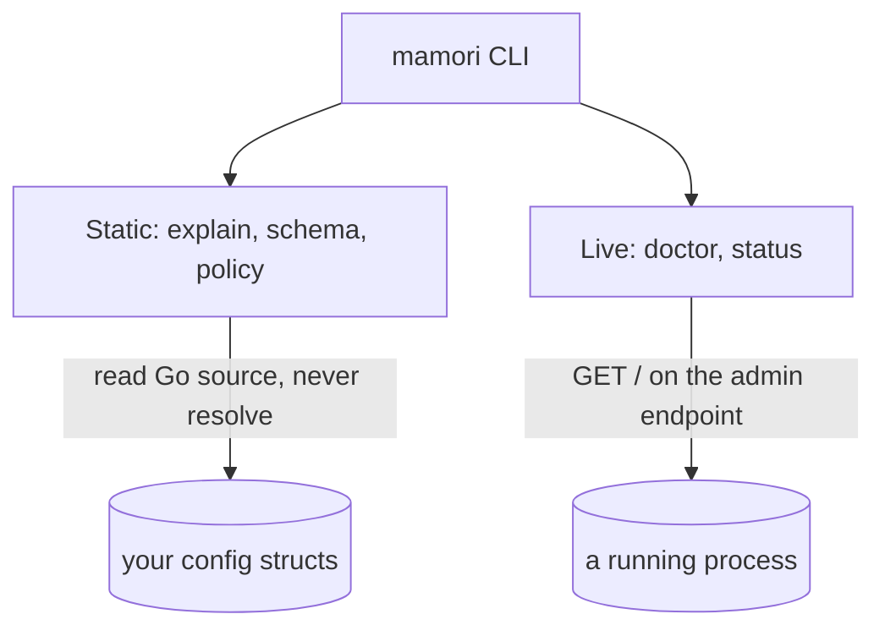

# CLI

`mamori` (import path `github.com/xavidop/mamori/cmd/mamori`) is a standalone CLI built around the same `source:` tag conventions and `Report` shape the library uses. It has two halves: **static commands** (`explain`, `schema`, `policy`) that read your Go source and never resolve anything, and **live commands** (`doctor`, `status`) that query a running process's admin endpoint. It never resolves secrets itself (see [How it works](#how-it-works) for why).



## Install

Both commands install the same binary. Homebrew tracks tagged releases; `go install` builds from source at whatever ref you name.

```bash
brew install xavidop/tap/mamori
```

```bash
go install github.com/xavidop/mamori/cmd/mamori@latest
```

## Quick start

Static commands take a Go package pattern (`./...` for a whole module, a package path, or nothing for the current directory). Read what a config struct declares:

```bash
$ mamori explain ./... --type=Config
main.Config
FIELD           TYPE           CHAIN                   DEFAULT  OPTIONAL  SENSITIVE
Redis.Addr      string         env://REDIS_ADDR        -        false     false
Redis.Password  secret.String  aws-sm://prod/redis-pw  -        false     true
```

Live commands query a running process over its admin endpoint and set an exit code you can branch on:

```bash
$ mamori doctor --endpoint https://svc.internal:9090
PATH            SCHEME  REF                     VERSION  STALE  LAST_KIND  LAST_ERROR  SENSITIVE
Redis.Addr      env     env://REDIS_ADDR        3        false  -          -           false
Redis.Password  aws-sm  aws-sm://prod/redis-pw  3        false  -          -           true

HEALTHY: 2 field(s), snapshot 3 (live 3), generated 2026-07-26T10:00:00Z
$ echo $?
0
```

## mamori explain

Prints every struct type with at least one `source:`-tagged field: its field paths, Go types, source chains, defaults, and which fields are sensitive.

```bash
mamori explain [patterns...] [--type=Name] [--json]
```

- `--type=Name` narrows to one struct by name.
- `--json` emits the same data as JSON instead of a table.

The table has one row per field, under a `package.TypeName` banner:

```bash
$ mamori explain ./...
main.Config
FIELD           TYPE           CHAIN                   DEFAULT  OPTIONAL  SENSITIVE
Redis.Addr      string         env://REDIS_ADDR        -        false     false
Redis.Password  secret.String  aws-sm://prod/redis-pw  -        false     true
Timeout         int            env://TIMEOUT           30       false     false
```

| Column | Meaning |
| --- | --- |
| `FIELD` | Dotted field path, e.g. `Redis.Password` |
| `TYPE` | The field's Go type, e.g. `secret.String` |
| `CHAIN` | The `source:` tag's comma-separated ref chain, in precedence order (see [Source chains and precedence](../concepts#source-chains-and-precedence)) |
| `DEFAULT` | The `default:` tag's value, or `-` if none |
| `OPTIONAL` | Whether the field carries `optional:"true"` |
| `SENSITIVE` | Whether the field is `secret.String`/`secret.Bytes`, or any ref in its chain uses a secret-bearing scheme |

## mamori schema

Emits a JSON Schema (draft 2020-12) derived from each qualifying struct's field types and `validate:` tags, ready to feed straight into a JSON Schema validator.

```bash
mamori schema [patterns...] [--type=Name]
```

- `--type=Name` narrows to one struct by name.
- If exactly one struct qualifies, the output is a single schema document. If more than one qualifies, it is a JSON array of documents, each carrying a `title` of `package.TypeName`.

```bash
$ mamori schema ./... --type=Config
{
  "$schema": "https://json-schema.org/draft/2020-12/schema",
  "title": "main.Config",
  "type": "object",
  "properties": {
    "Redis": {
      "type": "object",
      "properties": {
        "Addr": { "type": "string" },
        "Password": { "type": "string" }
      },
      "required": ["Addr", "Password"]
    },
    "Timeout": { "type": "integer", "minimum": 1, "default": 30 }
  }
}
```

`validate:` rules translate as far as JSON Schema allows: `required` and `oneof` map directly; `gte`/`lte` (always numeric) and `min`/`max` map to `minimum`/`maximum` on a number field or `minLength`/`maxLength` on a string field. A `default:` tag becomes the schema's `default`, typed as a JSON number where the field is numeric.

## mamori policy

Emits a least-privilege access artifact derived entirely from the `source:` refs in the loaded packages. It never resolves anything, and never fabricates an identifier no ref carries: missing account IDs, projects, and store names show up as clearly-marked placeholders for you to fill in.

```bash
mamori policy [patterns...] [--type=Name] --format=aws-iam|gcp|external-secret
```

`--format` is required. A format whose relevant refs are empty still emits a valid, empty artifact plus a stderr note, never a misleadingly-complete-looking success.

**`--format=aws-iam`** grants `secretsmanager:GetSecretValue` on every `aws-sm://` ref and `ssm:GetParameter`/`ssm:GetParameters` on every `aws-ps://` ref. The account ID and region are not part of a ref (both come from ambient AWS config at resolve time), so every ARN uses a `*:*` placeholder for them: fill those in before applying.

```bash
$ mamori policy ./... --format=aws-iam
{
  "Version": "2012-10-17",
  "Statement": [
    {
      "Sid": "SecretsManagerGetSecretValue",
      "Effect": "Allow",
      "Action": ["secretsmanager:GetSecretValue"],
      "Resource": ["arn:aws:secretsmanager:*:*:secret:prod/redis-pw"]
    }
  ]
}
```

**`--format=gcp`** lists `roles/secretmanager.secretAccessor` and the `projects/<project>/secrets/<name>` resource name for every `gcp-sm://` ref. A ref's project is part of the ref itself (`gcp-sm://<project>/<secret>`), so the real project is used; `PROJECT` only appears as a placeholder for a malformed ref. This is a summary you turn into IAM bindings (one `gcloud secrets add-iam-policy-binding` per resource), not a ready-to-apply GCP policy: a real binding also needs a principal, which no `source:` ref carries.

```bash
$ mamori policy ./... --format=gcp
{
  "role": "roles/secretmanager.secretAccessor",
  "resources": ["projects/my-project/secrets/redis-pw"]
}
```

**`--format=external-secret`** emits an `external-secrets.io/v1` `ExternalSecret` manifest with one `spec.data` entry per `aws-sm://`, `aws-ps://`, or `gcp-sm://` ref. `spec.secretStoreRef.name` is always a placeholder (`REPLACE_ME_SECRET_STORE`): no `source:` ref names a Kubernetes `SecretStore`.

```yaml
$ mamori policy ./... --format=external-secret
apiVersion: external-secrets.io/v1
kind: ExternalSecret
metadata:
  name: mamori-managed-secrets
spec:
  secretStoreRef:
    name: REPLACE_ME_SECRET_STORE
    kind: SecretStore
  target:
    name: mamori-managed-secrets
  data:
    - secretKey: aws-sm-redis-pw
      remoteRef:
        key: prod/redis-pw
```

## mamori doctor

GETs `/` on a running process's admin endpoint (`mamori.WithAdminHTTP` / `mamori.Handler`, see [Observability](../observability)) and renders the `mamori.Report` that comes back. It decodes, validates, and resolves nothing itself; it only renders and classifies.

```bash
mamori doctor --endpoint <ep> [--insecure] [--json] [--compare "<patterns>"]
```

- `--json` emits the admin endpoint's raw response body unchanged, byte for byte, instead of a table.
- `--compare` takes space-separated Go package patterns. It statically extracts `source:` refs from them (the same walk `explain` uses) and flags any field present in source but missing from the live report, or present live but not in source, which is drift between what your code declares and what the running process reports. It needs a real, buildable source tree, and does not change the exit code.

```bash
$ mamori doctor --endpoint https://svc.internal:9090 --compare ./...
PATH            SCHEME  REF                     VERSION  STALE  LAST_KIND  LAST_ERROR  SENSITIVE
Redis.Addr      env     env://REDIS_ADDR        3        false  -          -           false
Redis.Password  aws-sm  aws-sm://prod/redis-pw  3        false  -          -           true

HEALTHY: 2 field(s), snapshot 3 (live 3), generated 2026-07-26T10:00:00Z

compare: source vs. live field paths
  no drift: source and live field sets match
```

For the endpoint forms and credential flags, see [Endpoint and auth flags](#endpoint-and-auth-flags). For the exit codes it returns, see [Exit codes](#exit-codes).

## mamori status

Renders the same report table as `doctor`, without `--compare` or `--json`.

```bash
mamori status --endpoint <ep> [--insecure] [--watch] [--interval <dur>]
```

- `--watch` renders immediately, then again on every tick of `--interval` (default `2s`) until interrupted with Ctrl-C, instead of rendering once and exiting.
- `--interval <dur>` sets the poll interval when `--watch` is set (e.g. `5s`).

```bash
$ mamori status --endpoint unix:///run/app-admin.sock --watch --interval 5s
PATH        SCHEME  REF               VERSION  STALE  LAST_KIND  LAST_ERROR  SENSITIVE
Redis.Addr  env     env://REDIS_ADDR  3        false  -          -           false

HEALTHY: 1 field(s), snapshot 3 (live 3), generated 2026-07-26T10:00:00Z
# ...re-renders every 5s until Ctrl-C
```

## Exit codes

Both live commands share one exit-code table, structured so a script can tell "my config is broken" (exit `1`) apart from "I couldn't even see my config" (exits `2`/`3`/`4`).

| Code | Meaning |
| --- | --- |
| `0` | Healthy: the target process reports every field fresh with no terminal error |
| `1` | Unhealthy: reachable, but at least one field is stale or terminally errored |
| `2` | Reachable, but not a usable mamori admin API: a 404, or a 200 body that does not decode as a `mamori.Report` (the admin API is off, or this isn't a mamori process) |
| `3` | Unreachable: never got an HTTP response at all (connection refused, no such Unix socket, a TLS failure, or a malformed `--endpoint`) |
| `4` | Auth failed: a reachable mamori admin API returned `401` |

A deploy gate or alert branches on this directly: exit `1` means go fix the config; `2`/`3` mean go fix connectivity (or wire up `mamori.WithAdminHTTP` in the first place); `4` means go fix the credential. Collapsing these into a single "not healthy" bit throws away exactly the information an on-call engineer needs first.

`--watch` never returns any of these mid-loop: a single poll's outcome is only printed, and the command returns `0` once you interrupt it, since the point of `--watch` is to keep going through a transient failure.

## Endpoint and auth flags

`--endpoint` accepts three forms, matching what `mamori.WithAdminHTTP`/`mamori.Handler` serves and what the [config server](../server) accepts:

- `https://host:port`
- `unix:///path/to.sock`
- `http://host:port`, only with `--insecure` passed explicitly; a plain `http://` endpoint is refused otherwise.

Credentials reuse the same `Authenticator` schemes the admin endpoint supports (see [Auth](../auth)). Bearer and basic are mutually exclusive.

| Flag | Purpose |
| --- | --- |
| `--bearer` / `--bearer-file` | Bearer token, as a value or a file path (`-` for stdin) |
| `--basic` / `--basic-file` | `user:pass`, as a value or a file path (`-` for stdin) |
| `--client-cert` / `--client-key` | Client certificate and key (PEM) for mTLS |

**Prefer the file/stdin forms.** `--bearer`/`--basic` put the credential directly in `os.Args`, which lands in shell history and is visible to anything that can read this process's argv (e.g. another local user running `ps`). `--bearer-file`/`--basic-file` (including `-` for stdin, so a credential can be piped in without touching disk) keep the token out of both. This is the same reasoning [Auth](../auth) gives for preferring a file-backed credential over a bare flag or environment variable.

## How it works

**The CLI never resolves anything (decision D1).** The static and live halves never mix, and this is enforced structurally, not just by convention: the static commands' code path never opens a socket, and the live commands' code path never calls `go/packages`. Static commands answer "what does this config struct declare," not "what value does it currently hold." Live commands render whatever `mamori.Report` the target process's admin endpoint returns right now, holding no opinion of their own about what a config struct should look like. The one narrow exception is `doctor --compare`, documented as exactly that, a cross-check, not a blurring of the line.

**`mamori.Doctor[T]` (library) vs `mamori doctor` (CLI).** Both answer "is this config reachable and healthy," but at two different points in a system's life, and neither substitutes for the other:

- **`mamori.Doctor[T]`** (the core library function, see [Observability](../observability#check-reachability-before-deploying-with-doctor)) runs *inside* your own build, typically as a build-tagged CI test, before you deploy. It exercises your exact provider wiring, middleware, and `Prefix` rewriting because it *is* your code, calling the same `Load`/`Watch` machinery your service calls. It catches a rotated-away secret or a typo'd ref before it ships.
- **`mamori doctor`** runs from wherever you are, against a process that is *already running*, over the network or a socket. It has no idea how that process is wired internally; it only knows what the process's admin endpoint chooses to report. It is what you reach for during an incident, or as a deploy-time smoke check.

Run `mamori.Doctor` in CI to catch a problem before it ships. Run `mamori doctor`/`mamori status` against a live process to find out whether it did.

## See also

[Observability](../observability) covers the `Report`/`FieldStatus` shape and `WithAdminHTTP`/`Handler` in full, what the live commands are clients of. [Config server](../server) covers the separate `server` module, which shares the same endpoint forms and `Authenticator` types as the flags above. [Concepts](../concepts#source-chains-and-precedence) covers source chains and precedence, which is what `explain`'s `CHAIN` column and `policy`'s ref extraction read.
