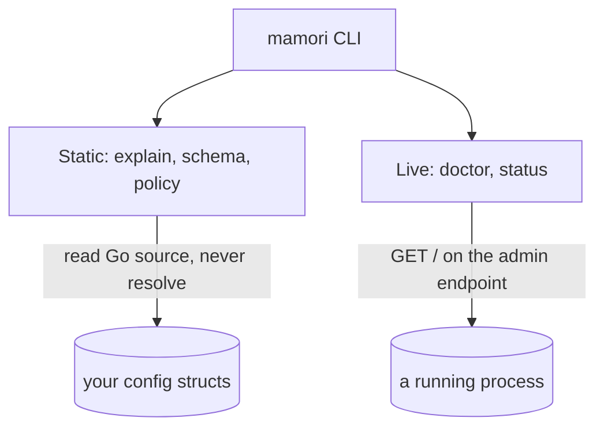

# CLI

`mamori` (import path `github.com/xavidop/mamori/cmd/mamori`) is a standalone CLI built around the same `source:` tag conventions and `Report` shape the library uses. It has two halves that never mix:

- **Static commands** ([`explain`](/docs/cli/explain/), [`schema`](/docs/cli/schema/), [`policy`](/docs/cli/policy/)) read your Go source and never resolve anything.
- **Live commands** ([`doctor` and `status`](/docs/cli/doctor-status/)) query a running process's admin endpoint and set an exit code.



## Install

Both halves are the same binary. Homebrew tracks tagged releases; `go install` builds from source at whatever ref you name.

```bash
brew install xavidop/tap/mamori
```

```bash
go install github.com/xavidop/mamori/cmd/mamori@latest
```

## Quick start

Static commands take a Go package pattern (`./...` for a whole module, a package path, or nothing for the current directory). Read what a config struct declares:

```bash
$ mamori explain ./... --type=Config
main.Config
FIELD           TYPE           CHAIN                   DEFAULT  OPTIONAL  SENSITIVE
Redis.Addr      string         env://REDIS_ADDR        -        false     false
Redis.Password  secret.String  aws-sm://prod/redis-pw  -        false     true
```

Live commands query a running process over its admin endpoint and set an exit code you can branch on:

```bash
$ mamori doctor --endpoint https://svc.internal:9090
HEALTHY: 2 field(s), snapshot 3 (live 3), generated 2026-07-26T10:00:00Z
$ echo $?
0
```

## Next

- [`mamori explain`](/docs/cli/explain/) - list every config struct and its `source:` refs.
- [`mamori schema`](/docs/cli/schema/) - emit a JSON Schema for a config struct.
- [`mamori policy`](/docs/cli/policy/) - emit a least-privilege access artifact.
- [`mamori doctor` and `status`](/docs/cli/doctor-status/) - check a running process, with exit codes.

## See also

[Observability](/docs/observability/) covers the `Report`/`FieldStatus` shape the live commands render. [Config server](/docs/server/) shares the same endpoint forms and `Authenticator` types. [Concepts](/docs/concepts/) covers source chains, which `explain`'s `CHAIN` column and `policy`'s ref extraction read.
