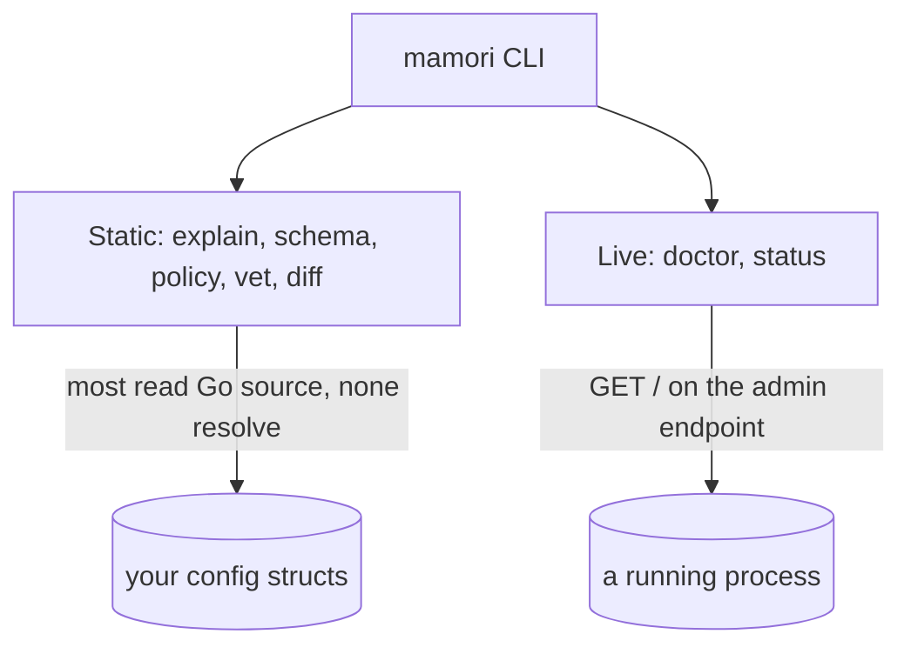

# CLI

`mamori` (import path `github.com/xavidop/mamori/cmd/mamori`) is a standalone CLI built around the same `source:` tag conventions and `Report` shape the library uses. It has two halves that never mix:

- **Static commands** ([`explain`](/docs/cli/explain/), [`schema`](/docs/cli/schema/), [`policy`](/docs/cli/policy/), [`vet`](/docs/cli/vet/), [`diff`](/docs/cli/diff/)) never resolve anything. The first four read your Go source; `diff` reads two `explain --json` outputs and needs no source at all.
- **Live commands** ([`doctor` and `status`](/docs/cli/doctor-status/)) query a running process's admin endpoint and set an exit code.



## Install

Both halves are the same binary. Homebrew tracks tagged releases; `go install` builds from source at whatever ref you name.

```bash
brew install xavidop/tap/mamori
```

```bash
go install github.com/xavidop/mamori/cmd/mamori@latest
```

## Getting help

Every command prints its own usage, including the flags it accepts and, for the sensitivity-aware ones, the built-in secret-bearing schemes:

```bash
mamori --help          # the command list
mamori vet --help      # one command's flags (also -h)
```

Help goes to stdout and exits `0`, so it pipes to a pager cleanly and a script checking the exit code does not read it as a failure. Errors are the opposite: the message and usage go to stderr with a non-zero exit.

## Quick start

Static commands take a Go package pattern (`./...` for a whole module, a package path, or nothing for the current directory). Read what a config struct declares:

```bash
$ mamori explain ./... --type=Config
main.Config
FIELD           TYPE           CHAIN                   DEFAULT  OPTIONAL  SENSITIVE
Redis.Addr      string         env://REDIS_ADDR        -        false     false
Redis.Password  secret.String  aws-sm://prod/redis-pw  -        false     true
```

Live commands query a running process over its admin endpoint and set an exit code you can branch on:

```bash
$ mamori doctor --endpoint https://svc.internal:9090
HEALTHY: 2 field(s), snapshot 3 (live 3), generated 2026-07-26T10:00:00Z
$ echo $?
0
```

## Next

- [`mamori explain`](/docs/cli/explain/) - list every config struct and its `source:` refs.
- [`mamori schema`](/docs/cli/schema/) - emit a JSON Schema for a config struct.
- [`mamori policy`](/docs/cli/policy/) - emit a least-privilege access artifact.
- [`mamori diff`](/docs/cli/diff/) - compare two `explain --json` outputs and report the config and privilege delta.
- [`mamori vet`](/docs/cli/vet/) - flag secret-bearing sources stored in plain `string`/`[]byte`.
- [`mamori doctor` and `status`](/docs/cli/doctor-status/) - check a running process, with exit codes.

## See also

[Observability](/docs/observability/) covers the `Report`/`FieldStatus` shape the live commands render. [Config server](/docs/server/) shares the same endpoint forms and `Authenticator` types. [Concepts](/docs/concepts/) covers source chains, which `explain`'s `CHAIN` column and `policy`'s ref extraction read.
