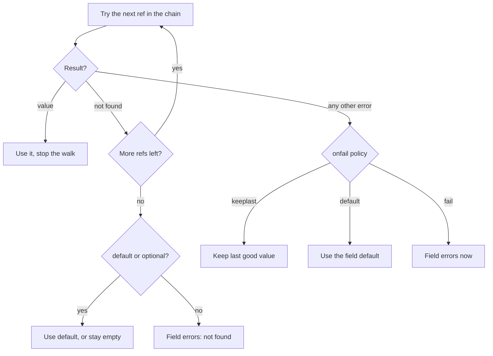

# Concepts

You annotate config struct fields with `source:` tags. mamori parses each tag into a ref (or a precedence chain of refs), resolves each ref to a `Value`, and applies validated results as monotonically versioned snapshots you can pin. Each concept below leads with a definition and a short example; the parsing rationale and reconciler internals live in [How it works](#how-it-works) at the end.

## The source ref grammar

A ref is a parsed pointer to a value in a provider, produced from a `source` tag by `ParseRef`. The grammar is:

```text
<scheme>://<path>[#<key>][?<opt>=<v>&...]
```

Opaque schemes such as `env:` and `exec:` take everything after the colon as the path (no `//`):

```go
type Config struct {
	// whole secret string
	APIKey     secret.String `source:"aws-sm://prod/api-key"`
	// one key of a JSON secret
	DBPassword secret.String `source:"aws-sm://prod/db#password"`
	// provider option
	Leased     secret.String `source:"vault://kv/data/api#key?renew=true"`
	// opaque scheme
	LogLevel   string        `source:"env:LOG_LEVEL"`
	// absolute file path
	Cert       []byte        `source:"file:///etc/tls/tls.crt"`
}
```

`ParseRef` produces a `Ref{Scheme, Path, Key, Opts, Raw}`. `#key` selects one field from a structured (JSON) payload; `?opts` are provider-specific plus a small set of core-recognized options (`debounce`, `optional`, `version`).

### Supplementary tags

Other struct tags refine how a field resolves:

| Tag | Meaning |
| --- | --- |
| `default:"..."` | Value used when the ref resolves to not-found (not on error). |
| `validate:"..."` | Field validation (go-playground/validator syntax), evaluated on **every** update. See the [Validation](../validation) page for the available rules. |
| `flatten:"json\|yaml\|env"` | Decode a single provider payload into a nested struct. |
| `optional:"true"` | Not-found is tolerated with no default (field keeps its zero value). |
| `onfail:"keeplast\|default\|fail"` | Policy for a chain error (not absence). Default `keeplast`. See [The onfail policy](#the-onfail-policy). |
| `?debounce=<dur>` | Per-field coalescing window override, e.g. `?debounce=0` for certs. |

Nested structs compose. A struct field with a `source` and `flatten` decodes one payload into the sub-struct; a struct field with no `source` is a container mamori recurses into:

```go
type Config struct {
	Redis RedisConfig `source:"aws-sm://prod/redis" flatten:"json"`
}

type RedisConfig struct {
	Addr     string        `mapstructure:"addr"`
	Password secret.String `mapstructure:"password"`
	DB       int           `mapstructure:"db"`
}
```

## Source chains and precedence

A `source` tag can hold more than one ref, comma-separated. This is a **precedence chain**, not a list of alternates tried on failure:

```go
type Config struct {
	Port string `source:"env:PORT,aws-ps://svc/port"`
}
```

The chain is walked in the order you declare:

1. The first ref that resolves to a value wins; the walk stops there.
2. A ref that resolves not-found falls through to the next ref in the chain.
3. A ref that fails with any other error (permission denied, unavailable, rate limited, an unregistered scheme, and so on) stops the walk immediately. Lower-priority refs are deliberately **not** tried: sliding to a lower-priority source because a higher-priority one is transiently broken would make config resolution depend on backend health instead of the order you declared. That error becomes the field's terminal error and is handled by the `onfail` policy below.
4. If every ref resolves not-found, the field falls back to `default:` / `optional:"true"` exactly as a single-ref field does.

A single-ref tag (the common case) is just a one-element chain, so an existing, untagged field behaves exactly as before.



This is precedence, not availability fallback. If what you want is "try the primary, and on a transport error use a replica of the *same* backend," that is `middleware.Failover` (see [Middleware](../middleware)), a decorator around one `Provider`. A source chain instead lets one field name sources across *different* schemes in priority order (an environment override ahead of a Parameter Store default, say), and it is a property of the tag, not the provider.

A comma splits the chain only when the text right after it looks like a new scheme (matches `^[a-zA-Z][a-zA-Z0-9+.-]*:`). A comma anywhere else, inside a query string or an opaque path, stays part of that ref's value:

```go
// Two refs: "env:PORT" and "aws-ps://svc/port"
Port string `source:"env:PORT,aws-ps://svc/port"`

// One ref: the comma in the query string is not a chain separator
Tags string `source:"consul://kv/tags?filter=a,b"`

// One ref: the comma in the exec: path is not a chain separator
Report string `source:"exec:echo a,b"`
```

To force a literal comma into a value where it would otherwise split, percent-encode it as `%2C` (see [How it works](#how-it-works) for the exact behavior).

### The onfail policy

`onfail` controls what a field does when step 3 above stops the walk on a genuine error, as opposed to absence:

| Policy | Behavior on a non-not-found error |
| --- | --- |
| `onfail:"keeplast"` (default) | Keep the last successfully applied value and report the error via `OnError`/`Status`. On the very first `Load` there is no prior value to keep, so it **fails** rather than silently falling back to `default:`. |
| `onfail:"default"` | Apply the field's `default:` value, exactly as if every ref in the chain had resolved not-found. This is the explicit opt-in for "treat this error like absence." It requires a `default:` tag and is rejected when the spec is parsed if there isn't one. |
| `onfail:"fail"` | Reject the candidate outright: the whole update on `Watch` (not just this field), or the whole `Load`. |

This is uniform for a single-ref field and a multi-ref chain. An untagged single-ref field is `onfail:"keeplast"`, reproducing today's behavior exactly.

The rule to hold onto: **`default:` applies only to genuine absence**, never to an error. A permission-denied, an outage, or a misconfigured provider never silently falls back to `default:` unless the field explicitly opts in with `onfail:"default"`. Masking a real error behind a quiet default is exactly the footgun mamori avoids elsewhere in this package (for example, classifying a missing `exec:` binary as `unknown` rather than `not_found` so it cannot be mistaken for absence).

### Chains are watched live

Every position in a chain is watched, not just the current winner, so precedence is live. Exporting a higher-precedence source at runtime takes over immediately: `Watch` recomputes the winner and delivers one `Change`, and removing it again falls back to whatever a lower-priority position already holds, again as one `Change`. A change to a position that is not currently winning is still observed (it is reflected in `Status()`) but does not move `Get()` or fire a `Change`, since a higher-priority ref is still winning. See [Loading & watching](../usage#source-chains) for a worked example of the takeover and fallback.

## The Value type

Providers return a `Value`, not raw bytes. This is the keystone for rotation and hygiene:

```go
type Value struct {
	Bytes     []byte
	Version   string            // provider revision: SM VersionId, Vault version, file mtime hash
	Sensitive bool              // drives redaction downstream
	NotAfter  time.Time         // zero if unknown; e.g. a Vault lease expiry schedules a refresh
	Metadata  map[string]string
}
```

`Version` gives cheap change detection (no byte comparison when the provider supplies a revision). `NotAfter` lets lease-based providers request a refresh *before* expiry rather than waiting for the next poll tick.

## Snapshot versions and pinning

Every `Watcher[T]` carries a monotonically increasing **snapshot version**: `1` at the initial load inside `Watch`, incremented by one each time a validated, non-empty update is applied.

```go
type Snapshot[T any] struct {
	Version uint64
	At      time.Time
	Config  T
	Fields  []FieldChange // what changed relative to the previous snapshot
}
```

`WithHistory(n)` (default `0`) retains the `n` most recent `Snapshot[T]` values in addition to the current one; `w.History()` returns them newest first.

### Pinning

Pinning freezes what `Get()` returns at a chosen snapshot while sources keep being watched and reconciled underneath:

```go
v := w.PinCurrent()   // freeze Get at the snapshot served right now, return its version
// ... investigate the frozen config ...
w.Unpin()             // resume, delivering one coalesced Change for all that changed while pinned
```

- `w.Pin(version)` freezes `Get()` at a retained snapshot (`ErrNoSuchSnapshot` if that version has fallen out of the retained window; raise `WithHistory` to pin further back).
- `w.PinCurrent()` freezes at whatever snapshot is being served right now and returns that version. It always succeeds and needs no retained history.
- `w.Unpin()` resumes, delivering exactly one coalesced `Change` for everything that changed while pinned.

The snapshot version keeps climbing in the background even while a pin has frozen `Get()`, since sources are still watched and reconciled the whole time. A pin holds back delivery to `Get()` and `OnChange` only, not the reconciliation itself, so the Live version reported by `Status()` diverges above the pinned version until you unpin. See [Loading & watching](../usage#snapshot-history-and-pinning) for the full pin/investigate/unpin walkthrough and [Security](../security#withhistory-retains-past-secrets-in-memory) for the secret-retention tradeoff that comes with turning `WithHistory` on.

## Error kinds

Every resolve failure carries a coarse, provider-independent classification you read with `mamori.ErrorKind(err)`. The typed `Kind` values are:

| `Kind` | Wire value | Sentinel (`errors.Is`) | Meaning |
| --- | --- | --- | --- |
| `KindNotFound` | `not_found` | `ErrNotFound` | Missing key, secret, path, or version. The only kind that drives resolution behavior. |
| `KindPermissionDenied` | `permission_denied` | `ErrPermissionDenied` | Authenticated but not authorized (IAM deny, Vault policy, Kubernetes RBAC). |
| `KindUnauthenticated` | `unauthenticated` | `ErrUnauthenticated` | Credentials missing, malformed, or expired; identity not proven. |
| `KindUnavailable` | `unavailable` | `ErrUnavailable` | Backend unreachable or unresponsive (network, DNS, timeout, 5xx, open breaker). |
| `KindRateLimited` | `rate_limited` | `ErrRateLimited` | Throttled or quota-exhausted by the backend. |
| `KindInvalid` | `invalid` | `ErrInvalid` | Ref malformed for the provider, or payload could not be parsed. |
| `KindUnknown` | `unknown` | (none) | An error the provider could not map. A legal outcome, not a failure. |

Only `not_found` changes behavior by default, since it is what triggers a field's `default:` or `optional` handling. The rest are diagnostic: telemetry (see `x/otel`'s `mamori.error.kind` attribute) and your own error-handling code use them to tell a misconfiguration from an outage. The one opt-in exception is `onfail:"default"` on a source chain, which explicitly treats a non-`not_found` error like absence too (see [The onfail policy](#the-onfail-policy)).

`errors.Is` reaches the sentinels through the error chain, so you can branch on a specific condition:

```go
if errors.Is(err, mamori.ErrPermissionDenied) {
    // the credential is fine, the authorization is not
}
```

`ErrorKind(nil)` returns the empty `Kind`; an error carrying no recognizable sentinel returns `KindUnknown` (a `context.DeadlineExceeded` is reported as `KindUnavailable`). `KindUnknown` and the empty `Kind` have no sentinel of their own.

## Secret types

Import `github.com/xavidop/mamori/secret`. `secret.String` and `secret.Bytes` redact themselves everywhere a value is normally rendered:

```go
s := secret.NewString("hunter2")

fmt.Println(s)              // [REDACTED]
fmt.Sprintf("%v", s)        // [REDACTED]
json.Marshal(s)            // "[REDACTED]"
slog.Info("login", "pw", s) // pw=[REDACTED]

s.Reveal()                  // "hunter2"  <- the only way to read it
s.Zero()                    // best-effort wipe of the backing bytes
```

`Reveal()` is deliberately the single, greppable access point, so secret reads are easy to audit. `Zero()` is best-effort: Go's GC may already have copied the value, and we document that honestly rather than promise memory safety we cannot deliver. The `reconcilevet` analyzer flags a secret-bearing ref stored in a plain `string`.

## How it works

Design notes and internals a user never calls directly. A curious reader reaches them here; nothing above depends on them.

### Why refs are parsed by hand

`ParseRef` does not use `net/url`. The mamori grammar places the optional `#key` fragment *before* the optional `?opts` query (the reverse of a standard URL), so the parser splits off the query first, then the fragment, then treats the rest as one opaque provider path. A hierarchical ref's `//` authority marker is stripped and folded into the path (except a fully-slashed form like `file:///etc/tls/tls.crt`, which keeps its leading slash); opaque schemes such as `env:` and `exec:` never have a `//` to strip.

### The comma-ambiguity rule in full

`splitChain` treats a comma as a chain separator only when the text after it matches `schemeStart` (`^[a-zA-Z][a-zA-Z0-9+.-]*:`). Because of that rule, a doubled or trailing comma is not a split point (no scheme token follows it) and is kept as part of the adjacent ref's value: `env:A,,env:B` yields a first ref with path `A,` rather than an empty chain entry. Such a malformed ref simply resolves not-found at lookup time and the chain falls through to the next entry, so `ParseRefs` treats it as a caller error rather than something it rejects outright.

To force a literal comma at a spot where it would otherwise be read as a separator, percent-encode it as `%2C`. mamori does not percent-decode it back: the ref's parsed path keeps the literal `%2C`.

```go
// Without escaping, "echo a,env:b" would split into two refs after the
// comma (env: looks like a new scheme). %2C keeps it one ref, and the
// resolved path is literally "echo a%2Cenv:b" (not "echo a,env:b").
V string `source:"exec:echo a%2Cenv:b"`
```

### Pinning is a reconciler command

`Pin`, `PinCurrent`, and `Unpin` are commands sent over a control channel to the reconciler goroutine, not a flag flipped from the caller's goroutine. `Unpin` has to apply the live config to `Get` and emit exactly one coalesced `Change`, and that has to happen on the reconciler goroutine to preserve serial `OnChange` delivery: doing it from a caller goroutine with an atomic flag would race the reconciler's own store and enqueue calls for a concurrently landing update.

While pinned, the live version and history keep advancing (so `Status()` can show the divergence and `Unpin` has something newer to apply) but `Get` and `OnChange` stay exactly as they were. The refresh counter still fires for reconciled fields during a pin, because a watched value genuinely changed and was reconciled; `Unpin` applies an already-reconciled snapshot and does not re-count those fields.

## See also

- [Loading & watching](../usage) covers source-chain takeover and the pin/investigate/unpin walkthrough end to end.
- [Validation](../validation) lists the `validate:` rules evaluated on every update.
- [Middleware](../middleware) covers `middleware.Failover` and other per-provider decorators.
- [Observability](../observability) and [OpenTelemetry](../opentelemetry) map `Kind` values onto `Report`/`FieldStatus` and the `mamori.error.kind` attribute.
- [Security](../security) covers the secret-retention tradeoff of `WithHistory`.
