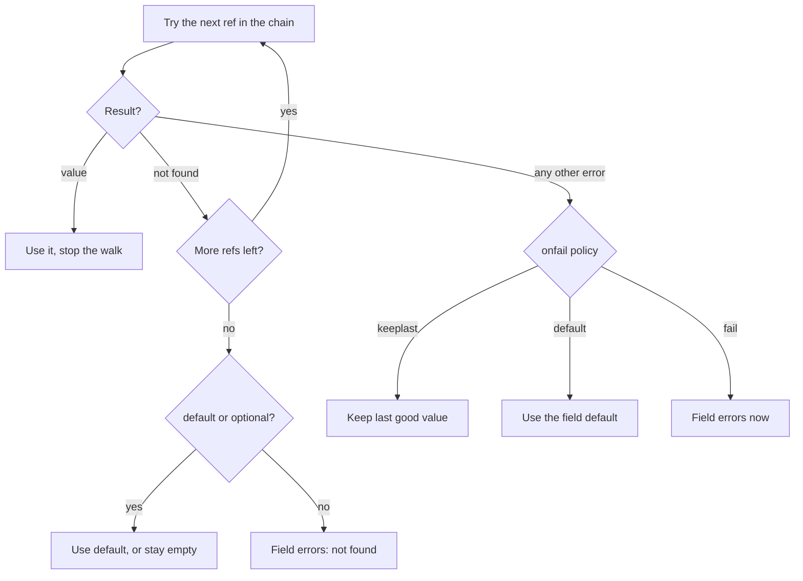

# Source chains and precedence

A `source` tag can hold more than one ref, comma-separated. This is a **precedence chain**, not a list of alternates tried on failure:

```go
type Config struct {
	Port string `source:"env:PORT,aws-ps://svc/port"`
}
```

A single-ref tag (the common case) is just a one-element chain, so an untagged field behaves exactly as before.

## How a chain resolves

The chain is walked in the order you declare:

1. The first ref that resolves to a value wins; the walk stops there.
2. A ref that resolves not-found falls through to the next ref in the chain.
3. A ref that fails with any other error (permission denied, unavailable, rate limited, an unregistered scheme, ...) stops the walk immediately. Lower-priority refs are deliberately **not** tried, so config resolution never depends on backend health instead of the order you declared. That error becomes the field's terminal error and is handled by `onfail` below.
4. If every ref resolves not-found, the field falls back to `default:` / `optional:"true"` exactly as a single-ref field does.



This is precedence, not availability fallback. To retry the *same* backend on a transport error, use `middleware.Failover` (see [Middleware](/docs/middleware/)), a decorator around one `Provider`. A source chain instead lets one field name sources across *different* schemes in priority order, and it is a property of the tag, not the provider.

## Live precedence: takeover and fallback

Every position in a chain is watched, not just the current winner, so precedence is live:

```go
type Config struct {
	Port string `source:"chain-a://port,chain-b://port"`
}

w, err := mamori.Watch[Config](ctx /* , providers for chain-a and chain-b */)
// chain-a absent, chain-b holds "8080":  w.Get().Port == "8080"

// chain-a is exported at runtime:
//   -> Watch recomputes the winner, one Change (Old "8080", New "9090")
//   -> w.Get().Port == "9090"

// chain-a is unset again:
//   -> falls back to chain-b's last value, one more Change (Old "9090", New "8080")
```

A change to a position that is not currently winning (chain-b updating while chain-a wins) is still observed in `w.Status()`, but it does not move `Get()` or fire a `Change`.

## The onfail policy

`onfail` controls what a field does when step 3 stops the walk on a genuine error, as opposed to absence:

| Policy | Behavior on a non-not-found error |
| --- | --- |
| `onfail:"keeplast"` (default) | Keep the last successfully applied value and report the error via `OnError`/`Status`. On the very first `Load` there is no prior value to keep, so it **fails** rather than falling back to `default:`. |
| `onfail:"default"` | Apply the field's `default:` value, as if every ref had resolved not-found. The explicit opt-in for "treat this error like absence." Requires a `default:` tag and is rejected at parse time without one. |
| `onfail:"fail"` | Reject the candidate outright: the whole update on `Watch` (not just this field), or the whole `Load`. |

The rule to hold onto: **`default:` applies only to genuine absence**, never to an error. A permission-denied, an outage, or a misconfigured provider never silently falls back to `default:` unless the field explicitly opts in with `onfail:"default"`.

## The comma-split rule

A comma splits the chain only when the text right after it looks like a new scheme (matches `^[a-zA-Z][a-zA-Z0-9+.-]*:`). A comma anywhere else, inside a query string or an opaque path, stays part of that ref's value:

```go
// Two refs: "env:PORT" and "aws-ps://svc/port"
Port string `source:"env:PORT,aws-ps://svc/port"`

// One ref: the comma in the query string is not a chain separator
Tags string `source:"consul://kv/tags?filter=a,b"`

// One ref: the comma in the exec: path is not a chain separator
Report string `source:"exec:echo a,b"`
```

Because of that rule, a doubled or trailing comma is not a split point (no scheme follows it) and is kept as part of the adjacent ref's value: `env:A,,env:B` yields a first ref with path `A,`, which resolves not-found and falls through.

To force a literal comma where it would otherwise split, percent-encode it as `%2C`. mamori does not decode it back; the parsed path keeps the literal `%2C`:

```go
// %2C keeps this one ref; the resolved path is literally "echo a%2Cenv:b".
V string `source:"exec:echo a%2Cenv:b"`
```

## See also

- [Concepts overview](/docs/concepts/) - the ref grammar and supplementary tags.
- [Watch for changes](/docs/usage/watching/) - Watch, Get, and change callbacks.
