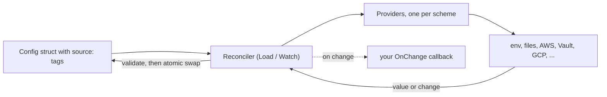

# Introduction

`mamori` (守り, "protection") loads typed, validated configuration and secrets into a Go struct from a broad provider ecosystem (environment, files, AWS, Vault, GCP, Azure, Kubernetes, Consul, and more), then keeps that struct reconciled while your program runs. Reach for it when you want one struct to describe every value your service needs, revalidated and hot-swapped whenever a source changes, without a restart.

## Install

The core module ships the `env:` and `file://` providers and has zero cloud-SDK dependencies:

```bash
go get github.com/xavidop/mamori
```

Requires Go 1.26 or newer. Each cloud or backend provider is a separate module, so its SDK only enters your build if you actually use it:

```bash
go get github.com/xavidop/mamori/providers/aws   # aws-sm://  aws-ps://
go get github.com/xavidop/mamori/providers/vault # vault://
go get github.com/xavidop/mamori/providers/k8s   # k8s-secret://  k8s-cm://
```

See the [Providers overview](providers) for the full list of schemes.

## Quick start

Tag a struct with `source:` refs, then call `Load`. A blank import registers a provider (the `database/sql` pattern):

```go
package main

import (
	"context"
	"log"

	"github.com/xavidop/mamori"
	"github.com/xavidop/mamori/secret"
	_ "github.com/xavidop/mamori/providers/aws" // registers aws-sm:// and aws-ps://
)

type Config struct {
	DBPassword secret.String `source:"aws-sm://prod/db#password"`
	LogLevel   string        `source:"env:LOG_LEVEL" default:"info" validate:"oneof=debug info warn error"`
	Workers    int           `source:"env:WORKERS" default:"4" validate:"gte=1,lte=256"`
	TLSCert    []byte        `source:"file:///etc/tls/tls.crt"`
}

func main() {
	cfg, err := mamori.Load[Config](context.Background())
	if err != nil {
		log.Fatal(err)
	}
	log.Printf("workers=%d level=%s password=%s", cfg.Workers, cfg.LogLevel, cfg.DBPassword)
	// password prints as [REDACTED]; cfg.DBPassword.Reveal() returns the value.
}
```

To react to changes at runtime instead of loading once, see [Loading & watching](usage).

## How it works

The model has three moving parts:

1. **Refs.** Each struct field carries a `source` tag: a small URL-ish reference to a value in some provider (`aws-sm://prod/db#password`, `env:LOG_LEVEL`, `file:///etc/tls/tls.crt`).
2. **Providers.** A provider resolves a scheme (`aws-sm`, `vault`, `env`, ...) into a `Value`. Providers register with the `database/sql` pattern, so the core module keeps zero cloud-SDK dependencies.
3. **The reconciler.** `Watch` resolves everything once (fail-fast), then watches each source: natively where the backend can push, by polling with jitter otherwise. On a change it re-validates the whole struct and, only if the result is valid, atomically swaps it in and fires your callback.



The payoff: rotate a database password in Secrets Manager and your connection pool rotates with it, without a restart and without a half-applied config ever being observed.

## Where to go next

- **[Concepts](concepts):** refs, providers, the reconciler, and the full `source`/`default`/`validate` tag grammar.
- **[Loading & watching](usage):** one-shot `Load` versus a live `Watch`, change events, source chains, and snapshot pinning.
- **[Validation](validation):** the `validate:` rules applied on load and on every update.
- **[Providers overview](providers):** every scheme, its watch strategy, and how to authenticate it.
- **[Config server](server):** the opt-in module that serves resolved values to other callers behind mandatory auth.
- **[CLI](cli):** `explain`, `schema`, and `policy` read your source statically; `doctor` and `status` probe a running process.
- **[Observability](observability):** `Status`, `Health`, the pre-deploy `Doctor` check, and the admin HTTP endpoint.
- **[Security](security):** secret hygiene, the two HTTP surfaces, and what `mamori` is deliberately not (it is not a secrets store).
