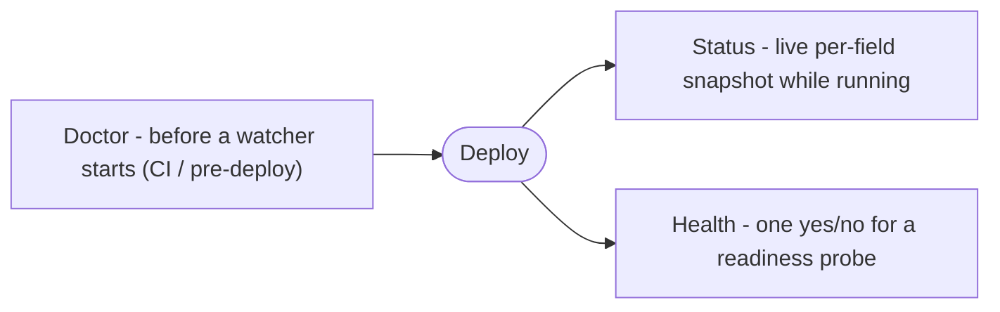

# Observability

Three functions answer "is my config healthy" at three different times: `Status` for a live snapshot, `Health` for a single yes/no a probe can act on, and `Doctor` for a pre-deploy check that runs before a watcher ever starts.



## Quick start

Read a running watcher's per-field health with `Status`, and back a readiness probe with `Health`.

```go
w, err := mamori.Watch[Config](ctx)
if err != nil {
	log.Fatal(err)
}
defer w.Close()

// Live snapshot: per-field health right now.
for _, f := range w.Status().Fields {
	log.Printf("%s (%s): kind=%s stale=%v age=%s", f.Path, f.Scheme, f.LastKind, f.Stale, f.Age)
}

// One-shot yes/no, ready to back a readiness probe.
http.HandleFunc("/readyz", func(rw http.ResponseWriter, r *http.Request) {
	if err := w.Health(); err != nil {
		http.Error(rw, err.Error(), http.StatusServiceUnavailable)
		return
	}
	rw.WriteHeader(http.StatusOK)
})
```

## Read the live Status

```go
func (w *Watcher[T]) Status() Report
```

`Status` returns a point-in-time report of the watcher's per-field health. `Age` and `Stale` are recomputed against the watcher's clock at call time, so a watcher that has gone quiet does not keep reporting the age it had at the last reconcile. It is lock-free (see [How it works](#how-it-works)).

```go
for _, f := range w.Status().Fields {
	log.Printf("%s (%s): kind=%s stale=%v age=%s", f.Path, f.Scheme, f.LastKind, f.Stale, f.Age)
}
```

A `Report` is safe to log, serialize, or hand to another team: `Ref` has sensitive query options redacted, and no field's resolved value ever appears anywhere in a `FieldStatus`. This holds whether the report came from a running `Watcher` or from `Doctor`.

### Report and FieldStatus fields

Every report shares this shape, whichever function produced it.

```go
type FieldStatus struct {
	Path      string        // dotted field path, e.g. "Redis.Password"
	Scheme    string        // provider scheme of the ref
	Ref       string        // the ref, with sensitive query options redacted
	Version   string        // provider version of the currently observed value
	LastOK    time.Time     // last successful resolve, zero if never
	Age       time.Duration // GeneratedAt minus LastOK, recomputed at read time
	Stale     bool          // Age exceeds the configured WithStale threshold
	LastError string        // text of the last resolve error, empty if none
	LastKind  Kind          // classification of LastError, empty if none
	Sensitive bool          // field is a secret.String or secret.Bytes
}

type Report struct {
	Fields      []FieldStatus
	Snapshot    uint64    // version of the snapshot Get currently returns (the pinned version, while Pinned)
	Live        uint64    // newest validated snapshot; diverges from Snapshot while Pinned
	Pinned      bool      // true when Get is frozen at Snapshot while Live keeps advancing; see Watcher.Pin
	Healthy     bool      // no field is stale or carries a terminal error kind
	GeneratedAt time.Time // when this report was built
}
```

`Snapshot` and `Live` are equal, and `Pinned` is `false`, unless the watcher is currently frozen with `Watcher.Pin` / `Watcher.PinCurrent`: see [Snapshot history and pinning](../usage#snapshot-history-and-pinning) for what that divergence means and how to produce and clear it.

## Check health for a probe

```go
func (w *Watcher[T]) Health() error
```

`Health` returns `nil` when every field is fresh and no field carries a terminal error kind. Otherwise it returns a `*HealthError` naming the offending fields, so a caller can log which fields are broken instead of a bare "unhealthy".

```go
if err := w.Health(); err != nil {
	var he *mamori.HealthError
	if errors.As(err, &he) {
		for _, f := range he.Fields {
			log.Printf("unhealthy: %s (%s): %s", f.Path, f.LastKind, f.LastError)
		}
	}
}
```

A field is unhealthy under one rule, shared by `Status`, `Health`, and `Doctor`:

- **Terminal kinds make a field unhealthy immediately**: `not_found`, `permission_denied`, `unauthenticated`, `invalid`. These will not clear without human action (fix the ref, grant access, renew a credential), so there is no reason to wait.
- **Transient kinds (`unavailable`, `rate_limited`) only make a field unhealthy once it is also stale**, that is, once `Age` exceeds the threshold set with `WithStale(maxAge)`. An unreachable backend or a throttled request is expected to self-heal on the next successful resolve, so a brief blip does not flip readiness; a field stuck in that state past the stale threshold does.
- No error at all is judged purely by staleness too.

See [Concepts](../concepts#error-kinds) for the full list of `Kind` values and what each one means.

## Check reachability before deploying with Doctor

```go
func Doctor[T any](ctx context.Context, opts ...Option) (Report, error)
```

`Doctor` resolves every field of `T` exactly once and returns a `Report` describing what succeeded and what failed, without starting a watcher. It accepts the same `Option`s as `Load` and `Watch`, so it exercises your real provider wiring, middleware, and `Prefix` rewriting.

Unlike `Load`, `Doctor` never aborts on the first failure: it walks every field and records each result, so one run tells you about every misconfigured ref instead of just the first one it hits. The returned `error` is non-nil only when `T` itself cannot be walked as a config struct (an unsupported field type, for example); individual field failures live in the `Report`, not in the returned error. `Doctor` does not decode or validate values either, since a field that resolves but fails validation is `Load`'s concern, not a reachability check's.

`Report.Snapshot` and `Report.Live` are always `0` for a `Doctor` report (and `Report.Pinned` is always `false`), marking it as a one-shot probe rather than a running watcher's snapshot (whose version starts at 1).

Run it as a build-tagged CI test, gated behind a tag so it only runs where real credentials and network access are available, and fail the build on any field that did not come back healthy:

```go
//go:build preflight

func TestConfigPreflight(t *testing.T) {
	rep, err := mamori.Doctor[Config](context.Background(), appProviders()...)
	if err != nil {
		t.Fatal(err)
	}
	for _, f := range rep.Fields {
		if f.LastKind != "" {
			t.Errorf("%s (%s): %s: %s", f.Path, f.Ref, f.LastKind, f.LastError)
		}
	}
}
```

```bash
go test -tags preflight ./...
```

That catches a rotated-away secret, a missing IAM permission, or a typo'd ref before it ships, instead of at container startup.

## Serve the report over HTTP

There are two ways to serve a `Report` over HTTP: mount `Handler` on a mux you already run, or let mamori run its own server with `WithAdminHTTP`. Both expose exactly the same two routes.

**This is a metadata endpoint. It never serves a configuration value, under any option, on any route.** The JSON body is always `w.Status()`, whose `Ref` fields are already redacted and which never carries a resolved value. For the surface that serves resolved config *values* to many callers, see the [config server](../server).

| Route | Response |
| --- | --- |
| `GET /` | The `Report`, as JSON (same shape as `w.Status()`) |
| `GET /healthz` | A liveness/readiness signal, `{"status":"ok"}` or `{"status":"unhealthy",...}` |

Every other path, and every other method, is `404`. No route, under any `HandlerOption` or admin option, returns a decoded field value. In particular, `Watcher.Pin` / `Watcher.PinCurrent` / `Watcher.Unpin` are **not** reachable through either route: `GET /` reports `Pinned` (and the `Snapshot`/`Live` divergence it causes) read-only, but nothing here changes it. An application that wants to pin remotely needs its own authenticated route calling `w.Pin` directly (see [Snapshot history and pinning](../usage#snapshot-history-and-pinning)).

### Mount Handler on your own mux

```go
func Handler[T any](w *Watcher[T], opts ...HandlerOption) http.Handler
```

```go
w, err := mamori.Watch[Config](ctx)
if err != nil {
	log.Fatal(err)
}
defer w.Close()

mux := http.NewServeMux()
mux.Handle("/", mamori.Handler(w))
go http.ListenAndServe(":8080", mux)
```

Mount it under a subpath with `HandlerPrefix`, which strips the prefix before the request reaches mamori's own routing:

```go
mux.Handle("/admin/", mamori.Handler(w, mamori.HandlerPrefix("/admin")))
```

`HandlerMiddleware` wraps the handler with a non-authentication concern, such as request logging, and runs outside `HandlerPrefix`'s stripping and outside any `WithAuth` check, in the order the options are given. Authentication itself, `WithAuth` and the shipped schemes, is covered on the [Auth](../auth) page.

### Run a standalone server with WithAdminHTTP

```go
func WithAdminHTTP(addr string, opts ...HandlerOption) Option
func WithAdminTLS(cfg *tls.Config) Option
```

```go
w, err := mamori.Watch[Config](ctx,
	mamori.WithAdminHTTP("127.0.0.1:9090"),
)
if err != nil {
	log.Fatal(err) // includes a bind failure
}
defer w.Close()

log.Printf("admin endpoint listening on %s", w.AdminAddr())
```

`WithAdminHTTP` exists for a caller who does not already run a mux of their own. It carries the same fail-fast lifecycle guarantees as the rest of mamori:

- **Off by default.** With no `WithAdminHTTP` option, there is no admin server (see [How it works](#how-it-works) for what that means internally).
- **A bind failure fails `Watch`.** The listener is bound before `Watch` returns, so a port already in use, or a permission error, comes back as `Watch`'s own error (the same way a failed initial `Load` does), rather than leaving you believing the endpoint is up when it is not.
- **`Close` releases the port.** `Watcher.Close` shuts the admin server down gracefully, bounded by a short grace period, before it returns, so by the time `Close` returns the port is free again.
- **`AdminAddr()` gives you the bound address** (`func (w *Watcher[T]) AdminAddr() net.Addr`), which is `nil` unless `WithAdminHTTP` was used. This is how you discover the port the OS actually chose when binding to `:0`.
- **`WithAdminTLS(cfg)` serves the admin endpoint over TLS** instead of plaintext, and has no effect without `WithAdminHTTP`. Pair it with an `Authenticator` (see [Auth](../auth)) so a credential sent to the endpoint is never sent in the clear.
- `Load` accepts `WithAdminHTTP` too, since `Load` and `Watch` share the same `Option` type, but `Load` has no long-lived watcher to run a server against, so it silently ignores the option.

## Wire a readiness probe

`GET /healthz` is built to back a Kubernetes readiness probe directly. Start the admin endpoint and point the probe at it:

```go
w, err := mamori.Watch[Config](ctx, mamori.WithAdminHTTP(":9090"))
```

```yaml
readinessProbe:
  httpGet:
    path: /healthz
    port: 9090
  periodSeconds: 5
```

An unauthenticated caller, such as a kubelet probe, always gets a bare status (`200 {"status":"ok"}` or `503 {"status":"unhealthy"}`), so readiness never depends on holding a credential, even when the endpoint has [`WithAuth`](../auth) configured. If auth is configured and the caller does authenticate, the response also includes the failing-field detail (the same fields a `*HealthError` carries); with no auth configured at all, every caller gets that full detail, since there is no credential to distinguish callers by. `/healthz` never returns `401`.

The response body is always metadata (a status string and, at most, field paths, redacted refs, and error kinds), never a config value.

## How it works

**One report shape, one definition of healthy.** `Status`, `Health`, and `Doctor` all produce the same `Report` and decide per-field health through a single shared rule, so the live answer, the one-shot yes/no, and the pre-deploy probe cannot drift apart. The terminal-vs-transient rule above is that one rule.

**`Status` is lock-free.** It reads the `Report` most recently published by the reconciler goroutine (through an atomic pointer) and works on a copy, never touching the engine's internal maps directly. That matters because the reconciler may be mid-mutation of those maps on its own goroutine at the exact moment `Status` is called. `Age` and `Stale` are then recomputed against the watcher's clock rather than the stored report's build time, which is why a watcher that has gone quiet reports its true current age.

**`Snapshot` and `Live` are the watcher's version counter.** A running watcher's snapshot version starts at 1 and advances as new validated snapshots are published; `Snapshot` freezes at the pinned version while `Live` keeps climbing during a pin. `Doctor` reports both as `0` to mark a one-shot probe rather than a running snapshot.

**Ref redaction.** Before a ref appears in a `Report`, the value of any query option whose name is on a fixed denylist (`token`, `password`, `secret`, `key`, `apikey`, `sas`, `credential`, and similar) is replaced with `secret.Redacted`, preserving the scheme, path, key, and non-sensitive options so the ref stays useful for diagnostics. That is what makes a `Report` safe to serve over HTTP.

**No admin server unless you ask for one.** With no `WithAdminHTTP`, `Watch` binds no listener and starts no extra goroutine. When set, the listener is bound before `Watch` returns (so a bind failure surfaces as `Watch`'s own error, mirroring its fail-fast on the initial `Load`), and the server's goroutine is tracked by the same wait group as the reconciliation engine, so `Watcher.Close` shuts it down before returning.

## See also

[Config server](../server) is the separate module that serves resolved config *values* to many callers, the counterpart to this metadata-only endpoint.

[Auth](../auth) covers `WithAuth`, the shipped `Authenticator` schemes, and credential rotation for the admin endpoint described above.

[OpenTelemetry](../opentelemetry) covers metrics and tracing for individual resolves (`mamori.resolve.duration`, `mamori.refresh.count`, the `mamori.resolve` span), which is complementary to but distinct from the reports on this page: OpenTelemetry answers "what happened over time," `Status`/`Health`/`Doctor` answer "what is true right now."
