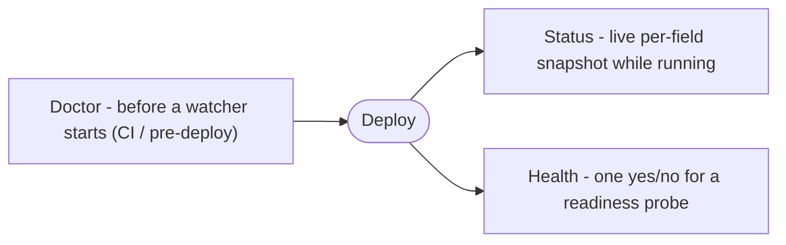

# Observability

Three functions answer "is my config healthy" at three different times: `Status` for a live per-field snapshot, `Health` for a single yes/no a probe can act on, and `Doctor` for a pre-deploy check that runs before a watcher ever starts.



## Quick start

Read a running watcher's per-field health with `Status`, and back a readiness probe with `Health`.

```go
w, err := mamori.Watch[Config](ctx)
if err != nil {
	log.Fatal(err)
}
defer w.Close()

// Live snapshot: per-field health right now.
for _, f := range w.Status().Fields {
	log.Printf("%s (%s): kind=%s stale=%v age=%s", f.Path, f.Scheme, f.LastKind, f.Stale, f.Age)
}

// One-shot yes/no, ready to back a readiness probe.
http.HandleFunc("/readyz", func(rw http.ResponseWriter, r *http.Request) {
	if err := w.Health(); err != nil {
		http.Error(rw, err.Error(), http.StatusServiceUnavailable)
		return
	}
	rw.WriteHeader(http.StatusOK)
})
```

## Status: the live snapshot

```go
func (w *Watcher[T]) Status() Report
```

`Status` returns a point-in-time report of the watcher's per-field health. `Age` and `Stale` are recomputed against the watcher's clock at call time, so a watcher that has gone quiet does not keep reporting the age it had at the last reconcile. It is lock-free.

```go
for _, f := range w.Status().Fields {
	log.Printf("%s (%s): kind=%s stale=%v age=%s", f.Path, f.Scheme, f.LastKind, f.Stale, f.Age)
}
```

A `Report` is safe to log, serialize, or hand to another team: `Ref` has sensitive query options redacted, and no field's resolved value ever appears in a `FieldStatus`. This holds whether the report came from a running `Watcher` or from [`Doctor`](/docs/observability/doctor/).

### Report and FieldStatus

Every report shares this shape, whichever function produced it.

```go
type FieldStatus struct {
	Path      string        // dotted field path, e.g. "Redis.Password"
	Scheme    string        // provider scheme of the ref
	Ref       string        // the ref, with sensitive query options redacted
	Version   string        // provider version of the currently observed value
	LastOK    time.Time     // last successful resolve, zero if never
	Age       time.Duration // GeneratedAt minus LastOK, recomputed at read time
	Stale     bool          // Age exceeds the configured WithStale threshold
	LastError string        // text of the last resolve error, empty if none
	LastKind  Kind          // classification of LastError, empty if none
	Sensitive bool          // field is a secret.String or secret.Bytes
}

type Report struct {
	Fields      []FieldStatus
	Snapshot    uint64    // version of the snapshot Get currently returns (the pinned version, while Pinned)
	Live        uint64    // newest validated snapshot; diverges from Snapshot while Pinned
	Pinned      bool      // true when Get is frozen at Snapshot while Live keeps advancing; see Watcher.Pin
	Healthy     bool      // no field is stale or carries a terminal error kind
	GeneratedAt time.Time // when this report was built
}
```

`Snapshot` and `Live` are equal, and `Pinned` is `false`, unless the watcher is frozen with `Watcher.Pin` / `Watcher.PinCurrent`: see [Snapshots and pinning](/docs/usage/snapshots/) for what that divergence means.

## Health: one yes/no for a probe

```go
func (w *Watcher[T]) Health() error
```

`Health` returns `nil` when every field is fresh and no field carries a terminal error kind. Otherwise it returns a `*HealthError` naming the offending fields, so a caller can log which fields are broken instead of a bare "unhealthy".

```go
if err := w.Health(); err != nil {
	var he *mamori.HealthError
	if errors.As(err, &he) {
		for _, f := range he.Fields {
			log.Printf("unhealthy: %s (%s): %s", f.Path, f.LastKind, f.LastError)
		}
	}
}
```

### When is a field unhealthy?

One rule, shared by `Status`, `Health`, and `Doctor`:

- **Terminal kinds are unhealthy immediately**: `not_found`, `permission_denied`, `unauthenticated`, `invalid`. These will not clear without human action.
- **Transient kinds (`unavailable`, `rate_limited`) only count once the field is also stale**, that is, once `Age` exceeds the threshold set with `WithStale(maxAge)`. A brief blip does not flip readiness; a field stuck past the stale threshold does.
- No error at all is judged purely by staleness too.

See [Error kinds](/docs/concepts/error-kinds/) for the full list of `Kind` values.

## Next

- [Doctor: pre-deploy check](/docs/observability/doctor/) - resolve every field once before a watcher starts, and fail a CI build if config would not resolve.
- [HTTP exposure](/docs/observability/admin/) - serve the report on your own mux or a standalone admin server, and back a Kubernetes readiness probe.

## See also

- [Config server](/docs/server/) serves resolved config *values* to many callers, the counterpart to this metadata-only endpoint.
- [Auth](/docs/auth/) covers `WithAuth`, the shipped schemes, and credential rotation for the admin endpoint.
- [OpenTelemetry](/docs/opentelemetry/) covers metrics and tracing for individual resolves, complementary to these reports: it answers "what happened over time," `Status`/`Health`/`Doctor` answer "what is true right now."
- [Prometheus](/docs/prometheus/) covers `x/prom`, the sibling metrics bridge for shops running Prometheus without OpenTelemetry.
