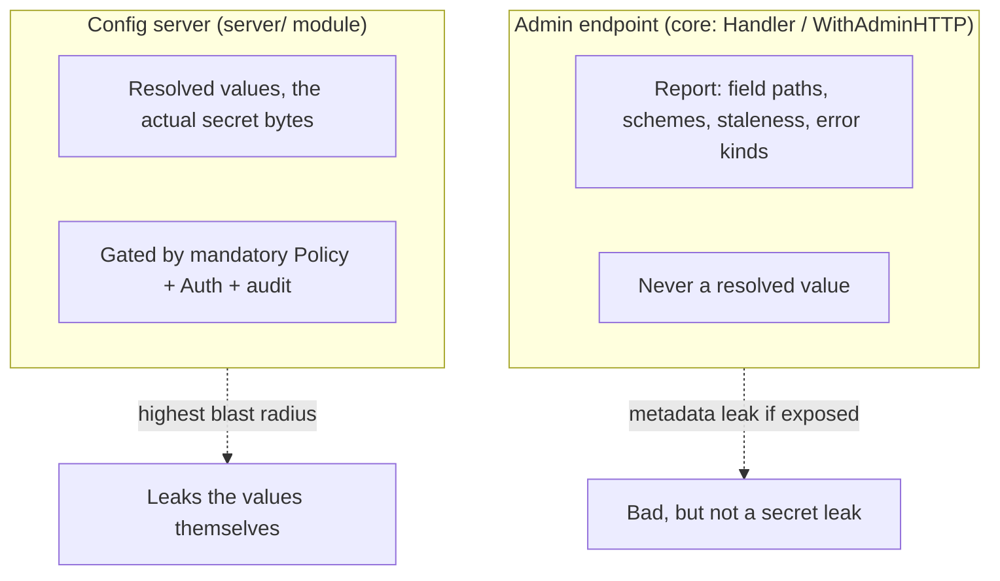

# Security & releases

mamori is built so secret values stay in process memory and never reach a surface that could leak them: logs, `fmt`, JSON, or the metadata it serves over HTTP. This page covers the guarantees you get automatically, the two deployment choices that are yours to get right (how you expose the admin endpoint, whether you retain history), and how releases are versioned and published.

## Two HTTP surfaces: metadata and values

mamori exposes exactly two things over HTTP, and they sit on opposite sides of a hard line.



- **The admin endpoint** (`Handler`, `WithAdminHTTP`, see [HTTP exposure](/docs/observability/admin/)) is part of the core module and serves operational metadata only: a `Report` of field paths, provider schemes, refs with sensitive query options redacted, staleness, and error kinds. It cannot serve a configuration value by construction, not by a check the handler could forget to make: the response body is always `w.Status()`, and a `Report` never carries a resolved value in the first place, so no route or option can return one even by mistake.
- **The [config server](/docs/server/)** (the separate `server/` module) serves resolved values, the actual secret bytes, gated by a mandatory authorization `Policy` expressed in terms of the `Identity` an `Authenticator` returns (see [Auth](/docs/auth/)). It concentrates every backend credential its bindings touch into one process, which makes it the highest-blast-radius component in mamori: compromising it is worse than compromising any single consumer that would otherwise hold its own slice of those credentials. See the config server's [Blast radius](/docs/server/#blast-radius) section for the full accounting and its structural mitigations (no client-supplied refs, mandatory policy, mandatory auth and TLS over the network, no values in the audit log).

Keep the two apart when reasoning about exposure. Pointing an unauthenticated admin endpoint at the public internet is a metadata leak, not a secret leak. That is still worth avoiding, but it is a categorically different mistake from misconfiguring the config server, which leaks the values themselves.

## `WithAdminHTTP` is unauthenticated by default

`WithAdminHTTP` starts with no `Authenticator` attached: any request that can reach the port gets the `Report`. Before exposing it beyond a single trusted host, do at least one of the following.

- **Bind to localhost or a non-ingress port.** Use `WithAdminHTTP("127.0.0.1:9090")` rather than a port your load balancer or ingress controller forwards, so the endpoint is reachable only from the same host or network namespace.
- **Require authentication.** Pass a shipped `Authenticator` scheme (or your own) as `WithAuth` to the admin handler (see [Auth](/docs/auth/)), so a request must present a credential.
- **Layer `WithAdminTLS`** on top, so a credential sent to the endpoint (a bearer token, a basic-auth password) is never sent in the clear. `WithAdminTLS` has no effect without `WithAdminHTTP`.

These combine. Bind to a non-ingress port and require auth when the endpoint has to be reachable from more than one host:

```go
w, err := mamori.Watch[Config](ctx,
	mamori.WithAdminHTTP("127.0.0.1:9090", mamori.WithAuth(auth)),
	mamori.WithAdminTLS(tlsConfig),
)
```

## Ref redaction

Every `Report.Fields[i].Ref` has a fixed denylist of query-option names redacted before it can leave the process: `token`, `password`, `secret`, `key`, `apikey`, `api_key`, `sas`, `credential`, `client_secret`, `secret_access_key`, `access_key`, `private_key`, `secret_key`, `pwd`, `passwd` (matched case-insensitively). The scheme, path, key, and any non-sensitive option are left intact so the ref stays useful for diagnostics; only the values behind those names are replaced with `secret.Redacted`.

One denylist covers every surface a ref leaves by: `Status()`, `Doctor`, the admin HTTP endpoint, error messages, log lines, the `Audit` middleware, and the span attributes handed to a `Tracer`. See [Observability](/docs/observability/) for the `Report` shape this applies to.

If you write your own `Meter`, `Tracer`, or middleware, call `Ref.Redacted()` rather than reading `Ref.Raw`. `Raw` is the tag exactly as written, so it still carries an inline credential when a provider accepts one as a query option; `Redacted()` applies the denylist above and is what everything inside mamori uses.

## Redaction and memory safety

These guarantees hold without any configuration on your part.

- Sensitive values never pass through `fmt` or logs unredacted. `secret.String` / `secret.Bytes` render as `[REDACTED]`, and only `Reveal()` exposes the value.
- [`mamori vet`](/docs/cli/vet/) catches sensitive refs stored in plain `string` / `[]byte` fields at `go vet` time.
- `Zero()` is best-effort and documented as such: Go's GC may already have copied the value, so mamori makes no false promises about memory safety.
- The `exec:` provider is off by default and must be enabled with `WithExecProvider()`. Refs are never interpolated from other resolved values, so there are no injection chains.
- Providers must not log payloads; the conformance kit enforces this with a log-capture assertion.

## `WithHistory` retains past secrets in memory

`WithHistory(n)` (see [Loading & watching](/docs/usage/snapshots/#retaining-snapshots-with-withhistory)) defaults to `0`: a `Watcher` normally keeps only its current, live snapshot. Turning it on trades that off against operability (being able to inspect what config looked like a few versions back, or `Pin` `Get()` to it) at a cost worth stating plainly.

- Each retained `Snapshot[T]` holds a **full copy of `T`** as it was at that version, including every `secret.String` / `secret.Bytes` field's value at the time.
- A secret that has since rotated is not gone from process memory just because it rotated: it stays reachable through `w.History()[i].Config` (or via `w.Pin` to that version) for as long as that snapshot sits inside the `n`-snapshot window.
- This does not weaken redaction in logs, `fmt`, or JSON. That protection lives on the `secret.String` / `secret.Bytes` type itself, not on whether history is enabled. It only extends how long an old secret value sits somewhere in memory, reachable by any application code that calls `Reveal()` on it.

Enable `WithHistory` deliberately: pick `n` for the operational need you actually have (recent-regression debugging, an audit trail of the last few changes), not "as large as possible." Leave it at the default `0` unless you have a concrete reason to look backward.

## Supply chain

The core module has minimal dependencies; each provider module isolates its SDK blast radius. Releases are published with checksums and SLSA provenance via GoReleaser.

Report vulnerabilities privately via [GitHub Security Advisories](https://github.com/xavidop/mamori/security/advisories/new), never in a public issue.

## Out of scope

`mamori` is not a secrets store and provides no encryption at rest. It is a library: it holds values in process memory only and writes nothing to disk. The core module's only server component is the optional, metadata-only admin HTTP endpoint above, which exposes no way to serve a configuration value. The separate [config server](/docs/server/) module does serve values, deliberately and behind mandatory auth and authz, but it is opt-in (a distinct module you must import and deploy) rather than something the core library does on your behalf. Protecting the backends it reads from (IAM policies, Vault ACLs, KMS keys) is your infrastructure's responsibility either way.

## Releases and versioning

Core releases are automated from [Conventional Commits](https://www.conventionalcommits.org/). When commits land on `main`, **semantic-release** decides the next version (`fix:` -> patch, `feat:` -> minor, breaking -> major), updates the changelog, and creates the `vX.Y.Z` tag; **GoReleaser** then builds the `mamori` CLI binary and publishes the GitHub Release with checksums, an SBOM, and SLSA provenance.

Modules are versioned with semantic-version git tags. The core module tags as `v0.1.0`; each submodule tags with its path prefix:

```text
v0.1.0                      # core
providers/aws/v0.1.0        # AWS provider module
x/otel/v0.1.0               # OpenTelemetry bridge
x/prom/v0.1.0               # Prometheus bridge
```

Import a specific version the usual way:

```bash
go get github.com/xavidop/mamori@v0.1.0
go get github.com/xavidop/mamori/providers/aws@v0.1.0
```

Each provider module keeps its own release cadence, so a breaking change in one SDK never forces a core release.
