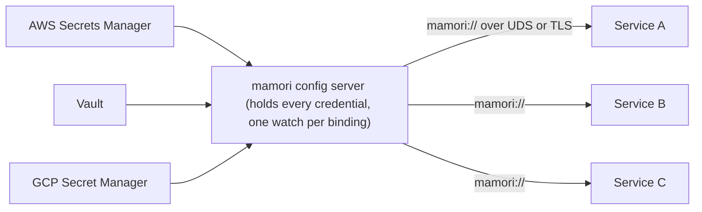

# Config server

`server` (import path `github.com/xavidop/mamori/server`) is a standalone process that fronts a fixed, operator-declared table of name-to-ref bindings and serves the resolved values to authenticated, authorized callers over a small v1 HTTP wire protocol (Unix socket and TLS TCP). Reach for it as a sidecar or a fan-out: one process holds the backend credentials and watches each upstream once, everyone else asks it for values by name. That concentration is also its main cost, so read [Blast radius](#blast-radius) before you deploy one.



## Quick start

Stand up a server that fronts two bindings over a `0600` Unix socket, gated by a bearer token and a per-subject policy:

```go
package main

import (
	"context"
	"log"
	"log/slog"
	"os"

	"github.com/xavidop/mamori"
	"github.com/xavidop/mamori/secret"
	"github.com/xavidop/mamori/server"
)

func main() {
	ctx := context.Background()

	srv, err := server.New(
		// Operator-declared bindings only: a client requests a name, never a ref.
		server.Bind("db-password", "vault://secret/data/db#password"),
		server.Bind("api-key", "aws-sm://prod/api-key"),

		// Providers resolve the ref schemes above (no registry fallback here).
		server.WithProvider(vaultProvider),
		server.WithProvider(awsProvider),

		// Authorization is mandatory.
		server.WithPolicy(server.PrefixPolicy(map[string][]string{
			"svc-orders": {"db-password"},
		})),

		// Authentication is mandatory (unless NoAuth() on a Unix socket).
		server.WithAuth(mamori.BearerToken(secret.NewString(os.Getenv("SERVER_TOKEN")))),

		// A Unix socket, owner read/write only.
		server.Unix("/run/mamori/server.sock", 0600),
	)
	if err != nil {
		log.Fatal(err)
	}
	defer srv.Close()

	if err := srv.Serve(ctx); err != nil {
		log.Fatal(err)
	}
}
```

A client resolves one binding through the `mamori://` provider ([mamoriprov](../providers/mamori)), attaching the same bearer token as an outbound header:

```go
import (
	"github.com/xavidop/mamori"
	mamoriprov "github.com/xavidop/mamori/providers/mamori"
	"github.com/xavidop/mamori/secret"
)

type Config struct {
	DBPassword secret.String `source:"mamori://db-password"`
}

cfg, err := mamori.Load[Config](ctx,
	mamori.WithProvider(mamoriprov.New(
		mamoriprov.Config{Endpoint: "unix:///run/mamori/server.sock"},
		mamoriprov.WithHeader("Authorization", "Bearer "+os.Getenv("SERVER_TOKEN")),
	)),
)
```

Or read it straight off the wire:

```sh
curl --unix-socket /run/mamori/server.sock \
  -H "Authorization: Bearer $SERVER_TOKEN" \
  http://unix/v1/values/db-password
```

`New` starts nothing: it validates every security invariant (a `Policy` is configured, auth is configured or `NoAuth()` is explicit, `NoAuth()` is never combined with TCP, every binding parses and passes its scheme gate) and returns a `*Server`. `Serve(ctx)` then begins upstream watching, binds every transport, and blocks until a listener fails or the server is closed. `Close()` is idempotent and safe even if `Serve` never ran, so defer it unconditionally right after `New`.

## Declare bindings

A binding maps a name (what a client requests) to a ref (what actually gets resolved). `Bind` declares one inline; `BindFile` reads a YAML file.

```go
func Bind(name, ref string) Option
func BindFile(path string) Option
```

```yaml
bindings:
  db-password: vault://secret/data/db#password
  api-key: aws-sm://prod/api-key
```

`Bind`/`BindFile` are the only way a binding comes into existence, and the operator calls them in the server's startup code. **A client sends a name, never a ref.** This is the whole security model: because a request can never carry its own ref, `file:///etc/shadow` and a client-chosen `exec:` command are unreachable by construction, not by a check a handler could forget. A duplicate binding name fails `New`, and all declarations are validated together in one pass after every option applies, so declaration order never matters.

Each binding resolves through the provider registered for its ref's scheme:

```go
func WithProvider(p mamori.Provider) Option
```

`WithProvider` registers a `Provider` for its own `Scheme()`. Every provider a binding can use is one the operator named explicitly; there is no process-wide registry fallback (see [How it works](#how-it-works)). A binding whose scheme has no registered provider still constructs cleanly and simply reports a resolve error on lookup while every other binding keeps working.

### Allow `exec:` and `mamori:` schemes

Two ref schemes are rejected at construction unless explicitly allowed:

```go
func AllowExec() Option
func AllowChaining() Option
```

- **`exec:`** runs an arbitrary command on the server's host. `AllowExec()` lifts the construction-time gate, but core's `exec:` provider has no exported constructor, so making an `exec:` binding resolve also requires you to supply your own exec `Provider` via `WithProvider`. Two deliberate steps for a scheme that means remote command execution reachable by every authorized consumer.
- **`mamori:`** chains to another config server. `AllowChaining()` lifts the gate; without it, a `mamori:` binding could quietly wire up a cycle.

Every other scheme (`env:`, `aws-sm:`, `vault:`, `file:`, `gcp-sm:`, and so on) needs neither option.

## Authorize with a Policy

`WithPolicy(p Policy) Option` is mandatory: `New` refuses to construct a `Server` with no policy, not even a deny-all default, so every deployment makes and sees itself make the choice.

```go
type Policy interface {
	Allow(id mamori.Identity, name string) error
}

type PolicyFunc func(id mamori.Identity, name string) error

func AllowAll() Policy
func PrefixPolicy(rules map[string][]string) Policy
```

- **`AllowAll()`** permits every identity access to every binding. Use it for a trusted-sidecar deployment where per-name rules add configuration without adding security. Because a policy is mandatory, choosing it is always an explicit, greppable line.
- **`PrefixPolicy(rules)`** grants access by subject: `rules[id.Subject]` is a list of `path.Match` globs checked against the requested binding name (`*` and `?` do not cross a `/`, and `[...]`/`[^...]` character classes work as in a shell glob). A subject with no entry is denied, with no fallback default-allow.
- **`PolicyFunc`** adapts a plain function, the same pattern as `mamori.AuthFunc` for `Authenticator`.

A denied name is indistinguishable from a nonexistent one: `Policy.Allow` is handed only an `Identity` and a name (never the binding table), and the wire handler always answers a denial with the same `403 permission_denied`. Authorization runs before the binding table is consulted, so a policy can never be used to enumerate what a server serves.

## Authenticate callers

```go
func WithAuth(a mamori.Authenticator) Option
func NoAuth() Option
```

Authentication is mandatory: `New` refuses to construct a `Server` with neither `WithAuth` nor `NoAuth()`. The config server reuses core's `Authenticator`/`Identity` unchanged (see [Auth](../auth)), so `BasicAuth`, `BearerToken`, `APIKey`, `MTLS`, `PeerCred`, and their `AnyOf`/`AllOf` composition all work here exactly as they do against the admin HTTP endpoint.

`NoAuth()` exists for a Unix-socket-only deployment where the filesystem (and, with `PeerCred`, the kernel) already bounds who can connect, but **`NoAuth()` is refused on a TCP listener.** TCP has no host boundary, so serving every binding to anonymous TCP callers would defeat the point of running a credential-holding server. `New` (not `Serve`) rejects that combination, so the mistake surfaces before any port is bound.

### Authenticate a Unix peer with `PeerCred`

`PeerCred` (documented in full on the [Auth](../auth#peercred) page) is the strongest option for a Unix-socket deployment: it authenticates a connecting process by the uid/gid the kernel reports at accept time (`SO_PEERCRED` on Linux, `LOCAL_PEERCRED` on Darwin), which the client cannot spoof. It requires this server's `Unix(...)` transport specifically, which wires up the plumbing that reads a connection's peer credentials (see [How it works](#how-it-works)).

## Choose a transport

```go
func Unix(path string, mode os.FileMode) Option
func TCP(addr string, opts ...TCPOption) Option
func TLS(cfg *tls.Config) TCPOption
func InsecureNoTLS() TCPOption
```

`Unix(path, mode)` binds a Unix-domain-socket listener at `path` with permission bits `mode`. `0600` (owner read/write only) is recommended for most deployments, since anyone who can connect to the socket can request any binding the policy allows them. Every connection accepted here has its kernel-verified peer credentials captured for a `PeerCred` authenticator.

`TCP(addr, opts...)` binds a TCP listener. **TCP without TLS fails construction** unless `InsecureNoTLS()` is given explicitly:

```go
server.TCP(":8443", server.TLS(tlsConfig))   // ordinary case
server.TCP(":8080", server.InsecureNoTLS())  // deliberate, greppable opt-out
```

`InsecureNoTLS`'s name is deliberately uncomfortable: `grep -r InsecureNoTLS` finds every place bindings are served over plaintext TCP, which should never be an accident. Prefer `TLS(cfg)` in any deployment not already isolated at the network layer.

Both transports can run at once, under the same policy and wire handler: call `Unix` and `TCP` any number of times, in any order, and `Serve` binds every one of them (every `Unix` listener before every `TCP` listener) before it accepts connections on any. `Addrs() []net.Addr` reports every bound listener's address, most useful for discovering the OS-chosen port after binding to `:0`. `Handler() http.Handler` returns the v1 wire protocol handler on its own, for mounting on a listener of your own.

## Audit requests

```go
func WithAudit(l *slog.Logger) Option
```

Audit logging is off by default. It is a diagnostic aid, not the enforcement mechanism (`Policy` and `Authenticator` decide access). When configured, one structured record is written per request (per name, for a batch or watch subscription), carrying identity subject, binding name, allow/deny decision, resulting `kind`, HTTP status, and latency.

**The audit record structurally cannot carry a resolved value.** The Go type backing an audit record (`requestOutcome`) has no field a value's bytes could be assigned to, so there is nowhere a `mamori.Value` could be accidentally wired into the log.

## v1 wire protocol reference

The handler `Handler()` returns (and `Serve` mounts on every transport) exposes four routes:

| Route | Purpose |
| --- | --- |
| `GET /v1/values/{name}` | Resolve one binding by name |
| `POST /v1/values` | Resolve a batch: body `{"names":[...]}` |
| `GET /v1/watch` | Subscribe to one or more bindings over Server-Sent Events |
| `GET /v1/healthz` | Bare liveness check |

This is a versioned wire protocol, not an internal detail: once an external client depends on today's routes and JSON fields, they are a stable contract (see [How it works](#how-it-works)). Every value-bearing response carries `Cache-Control: no-store`, so nothing that could hand back a secret is cacheable by an intermediary.

### Request ordering

Every route except `/v1/healthz` runs, in this exact order, on every request:

1. **Authenticate** (`mamori.Authenticator.Authenticate`, or skipped in `NoAuth` mode). Failure is `401`, with `WWW-Authenticate` set if the `Authenticator` implements `Challenger`.
2. **Authorize the specific name** (`Policy.Allow`), separately for every name in a batch or watch subscription. Failure is `403`.
3. **Only then** read the binding.

A denied caller gets `403` for a name whether or not it is a real binding: authorization runs and fails closed before the binding table is consulted. `GET /v1/healthz` is the one exception. It never calls `Authenticate` or `Policy.Allow` and never names a binding, so an uncredentialed liveness probe can never learn what the server holds.

### Response shapes

A successful single value, one entry of a batch response, or one SSE update frame all share one JSON shape:

```json
{
  "name": "db-password",
  "bytes": "aHVudGVyMg==",
  "version": "v3",
  "sensitive": true,
  "not_after": "2026-08-01T00:00:00Z",
  "metadata": {},
  "kind": ""
}
```

- **`bytes`** is base64-encoded (`encoding/json`'s standard `[]byte` handling, not a custom encoding).
- **`version`**, **`sensitive`**, **`not_after`**, **`bytes`**, and **`kind`** are all `omitempty`; `metadata` is never omitted (a `nil` map is normalized to `{}`, never JSON `null`).
- **`kind`** is empty for a fresh value; a non-empty `kind` on a successful response means last-known-good, described below.

A whole-request failure (auth failure, a malformed batch body, `GET /v1/values/{name}` for an unbound or unresolvable name) is:

```json
{"error": {"kind": "not_found", "message": "binding not found"}}
```

A batch or watch response never fails the whole request over one bad name: a single name that is denied, unbound, or unresolvable becomes exactly that one entry, shaped like an error but carrying the requested `name`:

```json
{"name": "some-other-binding", "error": {"kind": "permission_denied", "message": "permission denied"}}
```

**Distinguish success from failure by the presence of the `error` field, never by whether `bytes` is present.** A genuinely empty (zero-length) secret has its `bytes` key omitted exactly the way an error entry has no `bytes` key, so "no bytes means error" misreads a legitimate empty value (see [How it works](#how-it-works)).

`kind` round-trips through core's `mamori.ErrorKind`/`mamori.SentinelFor`, so a client can recover the original sentinel: `mamori.SentinelFor(mamori.Kind("permission_denied"))` gives back `mamori.ErrPermissionDenied`. The kind-to-status mapping:

| `kind` | HTTP status |
| --- | --- |
| `not_found` | 404 |
| `invalid` | 400 |
| `unauthenticated` | 401 |
| `permission_denied` | 403 |
| `rate_limited` | 429 |
| `unavailable` | 503 |
| `unknown` | 500 |

### Read `kind` on a success: fresh vs. stale-but-serving

`kind` appears in two structurally different places, and conflating them is the easiest client mistake:

- **On an error entry** (`{"error":{"kind":...}}`), `kind` is why the request failed.
- **On a successful value** (`bytes` present, no `error`), a non-empty `kind` means the server is serving a last-known-good value while the binding's upstream is currently failing. This is an annotation on a success, not a failure.

A client that ignores `kind` will silently keep using a value the server knows is stale; a client that treats any non-empty `kind` as an error will reject usable data. Check `error` presence for success vs. failure, and use `kind` on a success only to decide whether to log or alert on staleness.

### Subscribe to changes with `GET /v1/watch`

```text
GET /v1/watch?name=db-password&name=api-key
```

`/v1/watch` opens a Server-Sent Events stream: an `error` frame at subscribe time for any denied or unbound name (the stream still opens and stays live for the names that were allowed), then an `update` frame each time an allowed name's resolved state changes, plus a periodic heartbeat comment so idle-closing proxies do not drop the connection. This is a fast poll of already-resolved local state, not push from the backend (see [How it works](#how-it-works)). The stream ends when the client disconnects or a write fails; reconnecting is the client's responsibility.

### Probe liveness with `GET /v1/healthz`

```json
{"status": "ok"}
```

A fixed, unconditional `200`, never any binding detail. It is the one route exempt from authentication and authorization, so a liveness/readiness probe with no credential still works, and it is shaped to never become a way to learn what the server holds (no binding names, no per-binding health).

## Blast radius

State this plainly, because it is the single most important fact about this component: **a config server is deliberately the highest-blast-radius piece of mamori.** A single `Load` or `Watch` caller holds only the credentials it was configured with. A config server, by design, concentrates every backend credential its bindings touch into one process, reachable by every consumer it serves. Compromising it is strictly worse than compromising any one consumer: an attacker with code execution here potentially gains everything every binding can reach.

The mitigations are structural, not conventions an operator has to remember:

- **No client-supplied refs.** A client can only name a binding; it can never supply a ref. This eliminates the file-read/exec-injection class (`file:///etc/shadow`, an arbitrary `exec:` command) a naive "resolve whatever ref the client asks for" design would open.
- **Mandatory `Policy`.** `New` will not construct a `Server` with no authorization policy, not even a deny-all default.
- **Mandatory authentication over the network.** `NoAuth()` is refused with a TCP listener; the only unauthenticated posture allowed is Unix-socket-only, where the OS is the access boundary.
- **Mandatory TLS over TCP.** Plaintext TCP requires the deliberately uncomfortable, greppable `InsecureNoTLS()`; the default is TLS or refuse to construct.
- **No values in the audit trail.** An audit log that captured resolved secrets would be a second, lower-scrutiny copy of every credential; that is structurally impossible here, not merely discouraged.

None of this changes the underlying fact: the credentials are still all in one place. These mitigations narrow how the concentration can be abused, not the concentration itself. Weigh that for your own deployment: a trusted sidecar reading a handful of bindings over a `0600` Unix socket is a very different risk from a network-reachable server fronting every credential a large fleet needs, even though both are the same module. Treat the config server's own host and process the way you would treat a secrets-manager credential itself (least-privilege IAM for the backends it talks to, no unrelated workloads on the same host, its logs held to the same bar as the secrets it serves), because everything downstream inherits whatever happens to it.

## How it works

**Why fan out through a server at all.** The point is fewer places holding real credentials, not more. Every workload that would otherwise need its own AWS/Vault/GCP credential to resolve a ref directly instead needs only a credential (or a Unix socket) that reaches the config server, so a compromised workload's blast radius shrinks to the bindings its policy grants. Ten replicas watching `vault://secret/data/db` directly means ten lease renewals and ten poll loops; a config server resolves that ref once and fans the result out to as many readers as connect. And a workload with no good IAM story (a batch job, a short-lived container, a runtime that cannot assume a role) can still get a secret by authenticating to the server rather than to the cloud provider. Weigh all of this against [Blast radius](#blast-radius) above.

**How a binding resolves.** The server holds no polling loop of its own. Each binding is watched exactly once, through the same `mamori.WatchRef` machinery `Watch[T]` uses internally, and the result is fanned out to however many concurrent readers ask for it. There is no global-registry fallback: core's `Load`/`Watch` fall back to `mamori.Register`'s process-wide registry when no explicit provider is given, but that fallback is an unexported function private to the core package, so this module cannot reach it. Every provider is one the operator named with `WithProvider`, never whatever self-registered via some imported package's `init()`. A binding that has resolved at least once keeps serving its last-known-good value if the upstream later starts failing, the same "an update that fails validation never overwrites `Get()`" spirit `Load`/`Watch` apply, here applied per binding; that state surfaces as a non-empty `kind` on a successful response.

**The `PeerCred` seam.** Every connection accepted on a `Unix` listener has its kernel-verified peer credentials captured via `http.Server.ConnContext` and stashed in the request context (`mamori.PeerCredFromConn`, then `mamori.ContextWithPeerCred`), where `PeerCred.Authenticate` reads them. A failed read (including "unsupported platform" off Linux/Darwin) stashes nothing and the request is denied, never silently allowed. This plumbing is wired by `Unix(...)` specifically, which is why `PeerCred` needs that transport rather than an arbitrary `http.Handler` mount.

**Why `/v1/` is a frozen contract.** These routes and fields are a versioned wire protocol, not an implementation detail. The moment anything outside your control speaks it, today's shapes cannot change incompatibly, so treat every documented field as stable rather than a convenience to tweak later.

**The zero-length-value wrinkle.** `bytes`, `version`, `sensitive`, and `not_after` are all `omitempty`, so a genuinely empty secret has its `bytes` key omitted the same way an error entry never has one. That is why success and failure are distinguished by the presence of the `error` field, never by whether `bytes` is present.

**`/v1/watch` is a 200ms poll, not push.** The resolver exposes no push notification. `handleWatch` polls each subscribed binding's local, already-resolved snapshot every 200ms and sends a frame only when it differs from the last one sent. Each binding's snapshot is itself kept current by its own `WatchRef` goroutine, so a change usually lands on an open connection within roughly 200ms of the snapshot updating, which is usually indistinguishable from push. Do not build logic that depends on sub-poll-interval latency.

## See also

[Auth](../auth) covers every shipped `Authenticator`, including `PeerCred` in full. [Providers: mamori](../providers/mamori) is the `mamori://` client provider that resolves bindings against this server. [Security & releases](../security) covers the two HTTP surfaces mamori exposes side by side (the metadata-only admin endpoint and this server) and the blast-radius point in that context. [Observability](../observability) covers `WithAdminHTTP`, the metadata-only sibling to this server that answers "is my config healthy" rather than "give me a value."
