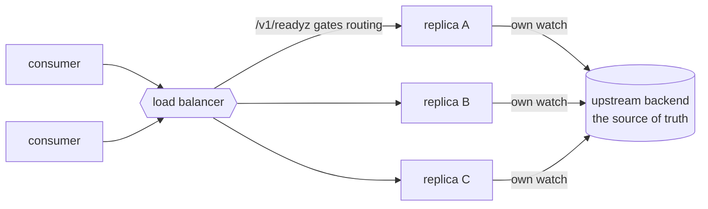

# High availability

Run several config server replicas behind one address so a single process is never a hard dependency for every consumer it serves.

The important thing to know first: **the config server holds no authoritative state.** It is a fan-out cache. Each replica watches upstream itself and caches the result, and the upstream backend stays the source of truth. So HA here means "several independent replicas, each safe to talk to", not a cluster. There is no leader election, no quorum, no replicated log, and no shared cache to operate, because there is no state to agree on.

What that leaves is a small number of real problems: not sending traffic to a replica whose cache is still cold, letting clients notice when they reach a replica that is behind, and failing over on the client side. Those are what this page covers.



## Readiness, the part that matters most

Every replica serves two probe endpoints, and they answer different questions:

| Endpoint | Question | Answer |
| --- | --- | --- |
| `GET /v1/healthz` | Is this process alive? | Always `200` for as long as it can reply at all |
| `GET /v1/readyz` | Should this replica get traffic? | `200` when ready, `503` while `priming` or `draining` |

Route on `readyz`, not `healthz`. A replica that has just started has resolved nothing yet: its cache is cold, and every request it accepts it can only fail. `healthz` cannot express that, by design, it is a liveness signal, so a load balancer using it will send real traffic to a replica that is not ready for it.

```bash
$ curl -s localhost:8080/v1/readyz
{"status":"priming"}     # 503, still resolving its bindings

$ curl -s localhost:8080/v1/readyz
{"status":"ready"}       # 200, every binding has settled
```

A replica becomes ready once every binding has **settled**, meaning it has a value or a definite upstream answer. Note the deliberate asymmetry: a binding that settled on an *error* still counts as ready. That error is what upstream is saying, and every other replica would say the same, so holding all of them out of rotation would turn one broken binding into a total outage.

The probes are unauthenticated, since a prober has no credential to offer. They therefore report a bare status and nothing else: no binding names, no counts, no node identity. Nothing an unauthenticated caller could use to map your deployment.

## Draining on shutdown

A load balancer only stops sending requests once it has *observed* a failing probe, which takes up to its probe interval. If a replica stops accepting the moment it is told to shut down, everything sent in that gap is refused.

`Close` marks the replica `draining` before it touches any listener, so the probe starts failing while requests are still being served normally. `DrainGrace` holds it in that state long enough for the balancer to notice:

```go
srv, err := server.New(
    server.WithPolicy(policy),
    server.WithAuth(auth),
    server.TCP(":8443", server.TLS(tlsCfg)),
    server.Bind("db-password", "aws-sm://prod/db#password"),

    // Stay up but report not-ready for 15s on Close, so the balancer
    // takes this replica out before its listeners stop accepting.
    server.DrainGrace(15*time.Second),
)
```

Set it to at least your balancer's probe interval times its unhealthy threshold. The default is zero, which tears down immediately, so nothing changes for deployments that have not opted in.

## Telling a stale replica from a fresh one

Each replica watches upstream on its own schedule, so two replicas routinely hold the same binding at different ages. Without help, a client that reconnects and lands on a laggier replica would apply an older value as though it were a new change, going backwards in time.

Every value response is therefore dated:

```json
{
  "name": "db-password",
  "bytes": "...",
  "resolved_at": "2026-07-26T21:04:11Z",
  "stale": false
}
```

- `resolved_at` is when *that replica* last fetched the bytes from upstream.
- `stale` is `true` when the replica is serving its last-known-good value because upstream is currently failing.

If you consume this with the [`mamori://` client](/docs/providers/mamori/), you get the protection for free: it tracks the newest `resolved_at` it has delivered per binding and **drops an update that is older**, so a watch that reconnects onto a laggier replica cannot hand your program a stale value dressed up as a change. Writing your own client is the only case where you need to compare the field yourself.

Both are omitted when they do not apply, so a single-replica deployment sees the wire shape it always did. Note that `resolved_at` dates the *value*, not the last attempt: a failed refresh carries the timestamp forward with the bytes it belongs to, so it always tells you how old the data you were handed really is.

## Client-side failover

The [`mamori://` client](/docs/providers/mamori/) can take a list of replicas and fail over between them, so you are not forced to put a load balancer in front:

```go
prov, err := mamoriprov.New(mamoriprov.Config{
    Endpoints: []string{
        "https://config-a.internal:8443",
        "https://config-b.internal:8443",
    },
})
```

Failover applies when a replica is unreachable or broken: a refused dial, a TLS failure, a timeout, `unavailable`, or an unclassifiable `5xx`. It deliberately does **not** apply to an authoritative answer, one every replica would give alike (`not_found`, `permission_denied`, `unauthenticated`, `invalid`, `rate_limited`). Retrying those would turn one clean `403` into one request per replica, and would amplify precisely the load a `rate_limited` throttle exists to shed.

`Watch` rotates endpoints on each reconnect, and backs off only after a full cycle through the list, so a dead replica cannot black-hole a stream. Setting both `Endpoint` and `Endpoints`, or mistyping any entry, is a configuration error rather than a silently dropped replica. Full detail on the [provider page](/docs/providers/mamori/#several-replicas).

## Attributing requests to a replica

Audit records carry a `node` field naming the replica that served the request, which is what makes "which replica returned that stale value" answerable after the fact. It defaults to the hostname, already the right answer under most schedulers, and is never sent to a client:

```go
server.NodeID("config-server-7")   // defaults to os.Hostname()
```

## What to watch out for

A few sharp edges are inherent to running N replicas, and no amount of code on our side removes them:

- **Unix sockets do not work for this.** A second replica binding the same socket path takes it over from the first, and a socket cannot be load balanced anyway. Multi-replica means TCP with TLS, which also means giving up [`PeerCred`](/docs/auth/schemes/) and using a token or mTLS scheme instead.
- **Watch (SSE) connections are sticky.** Each one is a long-lived stream against one replica, with no resumption cursor. Your balancer must not buffer responses, and its idle timeout must exceed the 15s heartbeat, or streams will be cut repeatedly. Clients reconnect on their own, possibly landing on a different replica, which is what makes `resolved_at` worth checking.
- **Upstream load multiplies by N.** Every replica watches every binding independently, so three replicas mean three times the calls to your secrets backend. Watch your rate limits, and prefer fewer, longer-lived replicas over many short-lived ones.
- **Configuration must match across replicas.** Bindings are declared per process, and nothing detects divergence. A replica started from a stale bind file simply reports "binding not found" for a name its peers serve happily, which looks identical on the wire to a name that was never bound. Ship the same config to every replica.

## Kubernetes example

```yaml
readinessProbe:
  httpGet: { path: /v1/readyz, port: 8443, scheme: HTTPS }
  periodSeconds: 5
  failureThreshold: 2
livenessProbe:
  httpGet: { path: /v1/healthz, port: 8443, scheme: HTTPS }
  periodSeconds: 10
```

Pair that with `DrainGrace(15 * time.Second)` and a matching `terminationGracePeriodSeconds`, so the pod stays up long enough to be pulled from the Service's endpoints before it stops accepting.

## See also

- [Deploy and expose](/docs/server/transports/) - the listeners a replica binds, and why TCP is required here.
- [Wire protocol](/docs/server/wire-protocol/) - the full response shapes, including `resolved_at` and `stale`.
- [Providers: mamori](/docs/providers/mamori/) - the client that consumes these replicas.
- [Observability](/docs/observability/) - the admin endpoint, the metadata-only surface for "is my config healthy".
