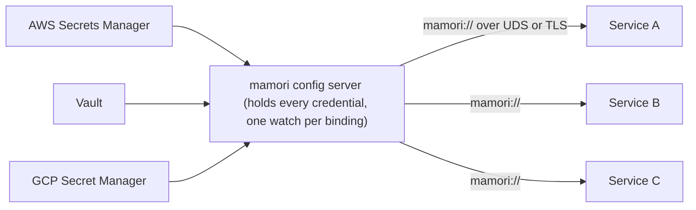

# Config server

`server` (import path `github.com/xavidop/mamori/server`) is a standalone process that fronts a fixed, operator-declared table of name-to-ref bindings and serves the resolved values to authenticated, authorized callers over a small v1 HTTP wire protocol (Unix socket and TLS TCP). Run it as a sidecar or a fan-out: one process holds the backend credentials and watches each upstream once, everyone else asks it for values by name. That concentration is also its main cost, so read [Blast radius](#blast-radius) before you deploy one.



## Quick start

Stand up a server that fronts two bindings over a `0600` Unix socket, gated by a bearer token and a per-subject policy:

```go
package main

import (
	"context"
	"log"
	"os"

	"github.com/xavidop/mamori"
	"github.com/xavidop/mamori/secret"
	"github.com/xavidop/mamori/server"
)

func main() {
	ctx := context.Background()

	srv, err := server.New(
		// Operator-declared bindings only: a client requests a name, never a ref.
		server.Bind("db-password", "vault://secret/data/db#password"),
		server.Bind("api-key", "aws-sm://prod/api-key"),

		// Providers resolve the ref schemes above (no registry fallback here).
		server.WithProvider(vaultProvider),
		server.WithProvider(awsProvider),

		// Authorization and authentication are both mandatory.
		server.WithPolicy(server.PrefixPolicy(map[string][]string{
			"svc-orders": {"db-password"},
		})),
		server.WithAuth(mamori.BearerToken(secret.NewString(os.Getenv("SERVER_TOKEN")))),

		// A Unix socket, owner read/write only.
		server.Unix("/run/mamori/server.sock", 0600),
	)
	if err != nil {
		log.Fatal(err)
	}
	defer srv.Close()

	if err := srv.Serve(ctx); err != nil {
		log.Fatal(err)
	}
}
```

`New` starts nothing: it validates every security invariant (a `Policy` is configured, auth is configured or `NoAuth()` is explicit, `NoAuth()` is never combined with TCP, every binding parses and passes its scheme gate) and returns a `*Server`. `Serve(ctx)` begins upstream watching, binds every transport, and blocks until a listener fails or the server is closed. `Close()` is idempotent and safe even if `Serve` never ran, so defer it unconditionally right after `New`.

A client resolves a binding through the `mamori://` provider ([mamoriprov](/docs/providers/mamori/)):

```go
type Config struct {
	DBPassword secret.String `source:"mamori://db-password"`
}

cfg, err := mamori.Load[Config](ctx,
	mamori.WithProvider(mamoriprov.New(
		mamoriprov.Config{Endpoint: "unix:///run/mamori/server.sock"},
		mamoriprov.WithHeader("Authorization", "Bearer "+os.Getenv("SERVER_TOKEN")),
	)),
)
```

Or read it straight off the wire:

```sh
curl --unix-socket /run/mamori/server.sock \
  -H "Authorization: Bearer $SERVER_TOKEN" \
  http://unix/v1/values/db-password
```

## Blast radius

**A config server is deliberately the highest-blast-radius piece of mamori.** A single `Load` or `Watch` caller holds only the credentials it was given; a config server, by design, concentrates every backend credential its bindings touch into one process, reachable by every consumer it serves. Compromising it is strictly worse than compromising any one consumer.

The mitigations are structural, not conventions an operator has to remember:

- **No client-supplied refs.** A client can only name a binding, never supply a ref, so `file:///etc/shadow` and arbitrary `exec:` commands are unreachable by construction. See [Server bindings](/docs/server/bindings/).
- **Mandatory `Policy`.** `New` will not construct a `Server` with no authorization policy, not even a deny-all default. See [Server auth and policy](/docs/server/authorization/).
- **Mandatory authentication over the network.** `NoAuth()` is refused with a TCP listener; the only unauthenticated posture is Unix-socket-only.
- **Mandatory TLS over TCP.** Plaintext TCP requires the deliberately uncomfortable, greppable `InsecureNoTLS()`. See [Deploy and expose](/docs/server/transports/).
- **No values in the audit trail.** Structurally impossible, not merely discouraged.

These mitigations narrow how the concentration can be abused, not the concentration itself. A trusted sidecar reading a handful of bindings over a `0600` Unix socket is a very different risk from a network-reachable server fronting every credential a fleet needs. Treat the config server's own host and process the way you would treat a secrets-manager credential itself.

## Next

- [Server bindings](/docs/server/bindings/) - `Bind`/`BindFile`, the operator-declared-only model, and the `exec:`/`mamori:` gates.
- [Deploy and expose](/docs/server/transports/) - Unix sockets, TLS TCP, running both, and the audit log.
- [Server auth and policy](/docs/server/authorization/) - `WithAuth`, the shipped schemes, and the `Policy` model.
- [High availability](/docs/server/ha/) - running several replicas: readiness gating, draining, freshness, and client failover.
- [Server wire protocol](/docs/server/wire-protocol/) - v1 routes, response shapes, the fresh-vs-stale `kind`, watch (SSE), and healthz.

## See also

[Auth](/docs/auth/) covers every shipped `Authenticator`, including `PeerCred`. [Providers: mamori](/docs/providers/mamori/) is the `mamori://` client that resolves bindings against this server. [Security](/docs/security/) covers the blast-radius point in the context of both HTTP surfaces. [Observability](/docs/observability/) covers `WithAdminHTTP`, the metadata-only sibling that answers "is my config healthy" rather than "give me a value."
