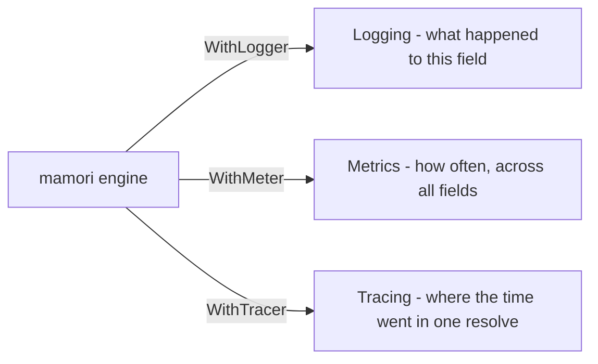

# Telemetry

Telemetry answers **what happened over time**. [Observability](/docs/observability/) answers **what is true right now**.

Both matter, and they fail you in different ways. `Status` will tell you a field is stale this instant; it cannot tell you the field has been flapping every ninety seconds since Tuesday. A counter tells you that, and cannot tell you which ref is broken at 3am. Reach for whichever answers the question you actually have.

## The three sinks

| | Option | Module | Answers |
| --- | --- | --- | --- |
| [Logging](/docs/telemetry/logging/) | `WithLogger` | core, no bridge | What happened to one field, in words, with the ref and error |
| [OpenTelemetry](/docs/telemetry/opentelemetry/) | `WithMeter`, `WithTracer` | `x/otel` | How often, across every field, plus spans per resolve |
| [Prometheus](/docs/telemetry/prometheus/) | `WithMeter` | `x/prom` | How often, for shops scraping Prometheus directly |

All three are off by default. mamori writes no logs and records no metrics until you pass an option, because a library that emitted telemetry merely for being linked in would be making a decision that belongs to the application.

## Choosing a metrics bridge

`x/otel` and `x/prom` implement the same `Meter` interface and record the same events. Pick on two questions.

**Do you want tracing?** Only `x/otel` offers it. Prometheus has no tracing concept, so `x/prom` is metrics and nothing else.

**Do you already run OpenTelemetry?** If yes, use `x/otel`, and reach Prometheus through OTel's own Prometheus exporter rather than adding a second bridge. If you use `prometheus/client_golang` directly and have no OTel anywhere, `x/prom` saves you the SDK.

Two differences will show up on a dashboard if you ever compare them. `x/otel` records durations in milliseconds, `x/prom` in seconds, each following its ecosystem's convention. And on a successful resolve `x/otel` omits the error-kind attribute entirely while `x/prom` sets it to the empty string, because a Prometheus `HistogramVec` requires the same label set on every series.

## What is never in telemetry

No resolved value reaches a log record or a metric label, ever.

Records and labels carry the field path, the provider scheme, the ref with sensitive query options redacted, the version, and the error kind. Never `Value.Bytes`, never a decoded field. Telemetry is the artifact most likely to leave the host for a collector you do not control, so this is enforced by tests rather than by convention.

Metric labels are additionally bounded: `scheme`, `status`, `error_kind`, and `reason` all draw from closed sets. A ref as a label would be both a credential leak and a cardinality bomb.

## Next

- [Logging](/docs/telemetry/logging/) - `WithLogger`, the full event table, and the two guarantees every record carries.
- [OpenTelemetry](/docs/telemetry/opentelemetry/) - `x/otel`, metrics and tracing.
- [Prometheus](/docs/telemetry/prometheus/) - `x/prom`, metrics for a Prometheus-native stack.

## See also

- [Observability](/docs/observability/) - `Status`, `Health`, and `Doctor` for what is true right now.
- [Error kinds](/docs/concepts/error-kinds/) - the closed `Kind` set that appears as an attribute on failures.
