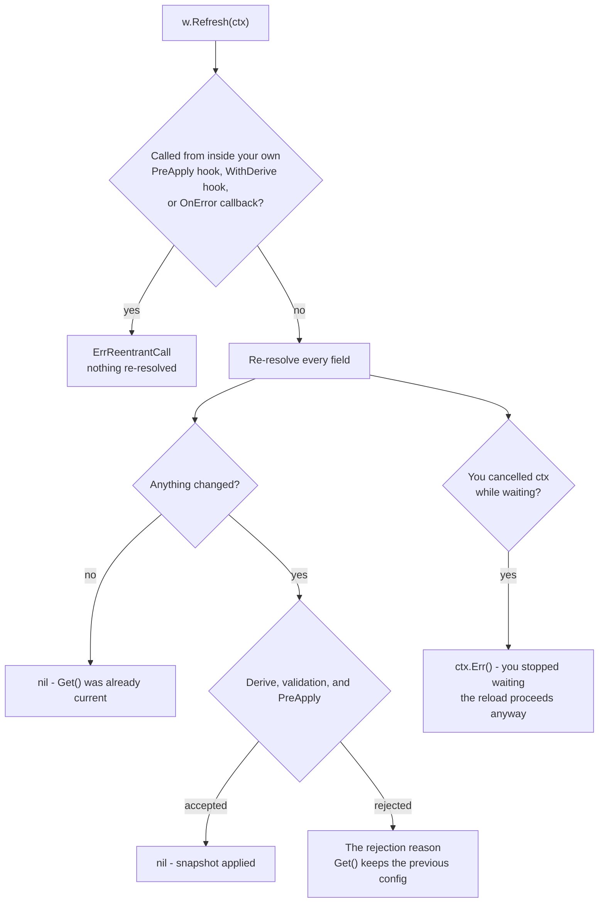
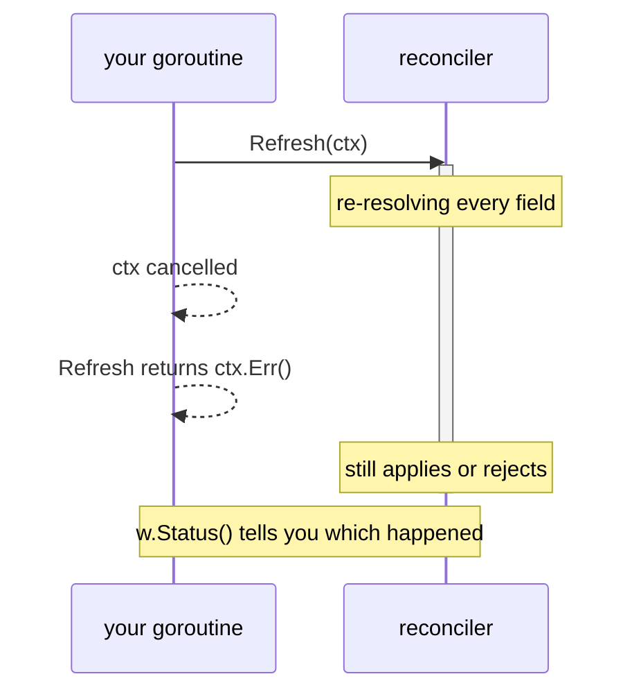

# Forcing a refresh

```go
func (w *Watcher[T]) Refresh(ctx context.Context) error
```

`Refresh` re-resolves every field now, ignoring poll intervals, and **blocks
until the result has been applied or rejected**. That block is the point: a
SIGHUP handler wants to know whether the reload worked, not that one was
queued.

```go
sighup := make(chan os.Signal, 1)
signal.Notify(sighup, syscall.SIGHUP)

for range sighup {
	switch err := w.Refresh(ctx); {
	case err == nil:
		log.Println("reload applied")
	case ctx.Err() != nil:
		// You stopped waiting; the reload still proceeds. w.Status() has the outcome.
		log.Printf("stopped waiting for the reload: %v", err)
	default:
		log.Printf("reload rejected, still serving the previous config: %v", err)
	}
}
```

## Reading the return value



`nil` means `Get()` is current, either because a snapshot was applied or
because nothing had changed.

An error means one of two very different things, and the example above splits
them deliberately:

**A rejection**, which is what you usually want to report:

- a `WithDerive` hook returned an error (a `*DeriveError`),
- a field failed validation,
- `PreApply` rejected the candidate (a `*PreApplyError`),
- a field is blocked by `onfail:"fail"` and stayed blocked.

**Not a rejection**, so do not log it as one:

- `ctx.Err()` means *you* stopped waiting. The reload proceeds anyway.
- A closed-watcher error means there was no reconciler left to ask.

Treating every non-nil error as a rejection would log "still serving the
previous config" for a reload that actually landed.

## `ctx` bounds the wait, not the work

Cancelling `ctx` makes `Refresh` return and stop waiting, but the command is
already with the reconciler and still applies or is rejected as usual. There is
no way to recall it, and no half-applied snapshot either way.



## It does not bypass `PreApply`

A forced refresh is gated exactly like any other reconciliation. Skipping the
gate on the one call an operator reaches for right after a rotation, when a
gate matters most, would defeat having one.

**Do not call `Refresh` from inside a `PreApply` hook, a `WithDerive` hook, or
an `OnError` callback.** All three run on the reconciler goroutine, which is
the goroutine that would have to service the refresh, so it returns
`ErrReentrantCall` immediately rather than hanging. Giving it a fresh
`context.Background()` does not help; that would simply block until `Close`.
Refresh from another goroutine, or let the next reconciliation carry it. See
[Do not call back into the same Watcher](/docs/usage/rotation/#do-not-call-back-into-the-same-watcher).

## While pinned

A refresh still re-resolves, still runs the gate, and still advances `Live`
and history. It just does not move `Get()`, which is what the pin is for. It
returns `nil`, and `Unpin` publishes the result. `Refresh` never unpins for
you.

## What it costs

`Refresh` runs **on** the reconciler goroutine. For as long as the walk over
every field takes, `Pin` and `Unpin` go unserviced, watch updates back up, and
no new `Report` is published. It is built for an operator-triggered reload, a
SIGHUP or an admin action, not for a hot path or a loop.

Its round trips also skip the normal resolve path, so they do not appear in a
[`WithTracer`](/docs/telemetry/opentelemetry/) span or a
[`WithMeter`](/docs/telemetry/opentelemetry/) resolve metric, and they skip
`BatchProvider` grouping: a scheme that usually batches several fields into one
call pays one call per field here.

## Two boundaries worth knowing

For a field resolved through a `mamori://` ref, `Refresh` re-reads the
[config server's](/docs/server/) current value. It does not reach past the
server to force *its* upstream to re-resolve.

There is no `POST /refresh` on the
[admin endpoint](/docs/observability/admin/#no-post-refresh): that surface is
deliberately read-only. Mount your own authorized handler if you want an
HTTP-triggered reload.

## See also

- [Rotation safety](/docs/usage/rotation/) - `PreApply`, which gates a refresh too.
- [Snapshots and pinning](/docs/usage/snapshots/) - what pinning does to `Get`.
- [Config server](/docs/server/) - what a refresh means for a `mamori://` field.
