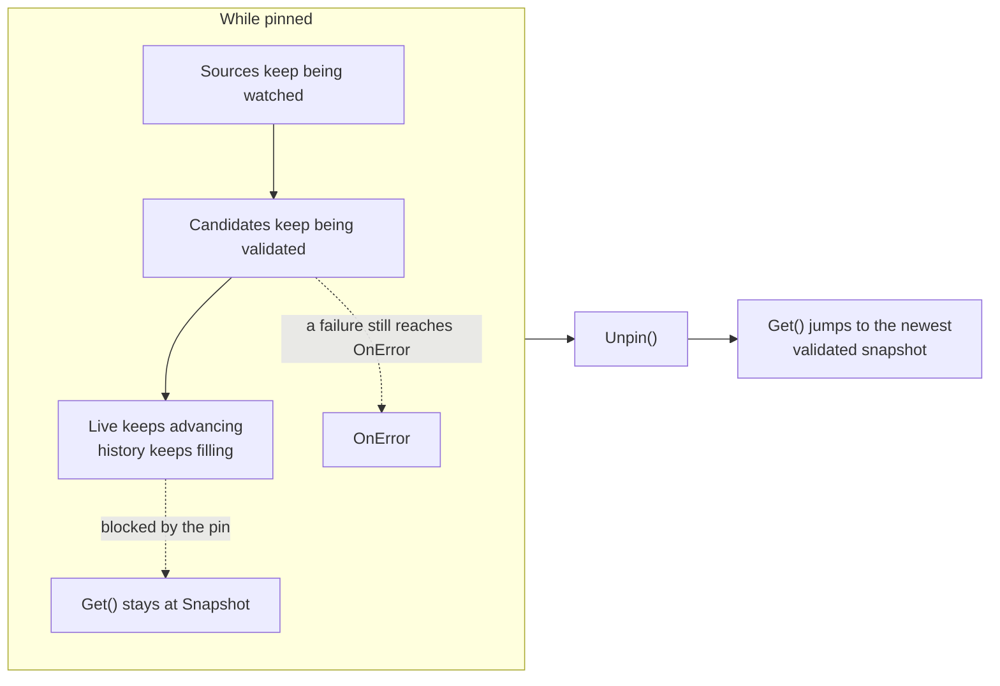

# Snapshots and pinning

A `Watcher` can inspect per-field health, retain past snapshots, and freeze what `Get()` returns while you investigate, without stopping reconciliation underneath: sources keep being watched, only what reaches `Get()` and `OnChange` is held back.

Each applied update is a `Snapshot[T]`:

```go
type Snapshot[T any] struct {
	Version uint64
	At      time.Time
	Config  T
	Fields  []FieldChange // what changed relative to the previous snapshot
}
```

`Version` increments on each validated, non-empty update.

## Check field health with Status in a watch loop

`w.Status()` returns a point-in-time `Report` of every field's health: which ref is winning, how stale it is, and the last error kind. It is lock-free and safe to call from any goroutine.

```go
rep := w.Status()
log.Printf("snapshot=%d live=%d pinned=%v healthy=%v",
	rep.Snapshot, rep.Live, rep.Pinned, rep.Healthy)

for _, f := range rep.Fields {
	log.Printf("%s via %s: age=%s stale=%v %s",
		f.Path, f.Ref, f.Age, f.Stale, f.LastError)
}
```

`rep.Snapshot` is the version `Get()` currently returns and `rep.Live` is the newest validated version underneath it; the two diverge only while pinned (below). For a readiness probe, `w.Health()` returns `nil` when every field is fresh and error-free, or a `*HealthError` naming the broken fields. See [Observability](/docs/observability/) for `Status`, `Health`, and the read-only HTTP exposure.

## Retaining snapshots with `WithHistory`

By default a `Watcher` keeps only its current snapshot. `WithHistory(n)` retains the `n` most recent snapshots in addition to the current one:

```go
func WithHistory(n int) Option
func (w *Watcher[T]) History() []Snapshot[T] // newest first, always includes current
```

```go
w, err := mamori.Watch[Config](ctx, mamori.WithHistory(10))
if err != nil {
	log.Fatal(err)
}
defer w.Close()

for _, snap := range w.History() {
	log.Printf("v%d at %s: %d field(s) changed", snap.Version, snap.At, len(snap.Fields))
}
```

Retained snapshots hold a full copy of `T`, including any `secret.String` / `secret.Bytes` field's value at that version, even after the live config has since rotated that field away. Enabling history extends how long old secret material stays reachable in process memory, which is why `WithHistory` defaults to `0` (off). Read [Security](/docs/security/#withhistory-retains-past-secrets-in-memory) before enabling it in a service that handles credentials, and size `n` to the operational need you actually have.

`WithHistory(1)` is also what a service validating *incoming* credentials during a rotation overlap needs, accepting either the current or the just-rotated-out value for the window both are momentarily valid. See [Rotation safety](/docs/usage/rotation/#accepting-both-credentials-during-a-rotation-window) for the pattern and its memory cost.

## Pin and unpin during a rollout

During a rollout you often want the config to hold still while you investigate, without stopping the watcher: sources keep being watched and reconciled, but whatever `Get()` returns should not shift under you mid-investigation.

A pin freezes only what `Get()` serves. Everything upstream of that keeps moving, which is the whole point:



`Status()` reports both numbers, so `Snapshot` is what `Get()` serves and `Live` is what it would serve if you unpinned right now. They are equal, and `Pinned` is false, whenever no pin is held.

```go
func (w *Watcher[T]) Pin(version uint64) error // ErrNoSuchSnapshot if version is not retained
func (w *Watcher[T]) PinCurrent() uint64       // pins whatever Get() serves right now; always succeeds
func (w *Watcher[T]) Unpin()                   // resumes; a no-op if not currently pinned
func (w *Watcher[T]) Pinned() (uint64, bool)   // the current pin, if any
```

The pin, investigate, unpin pattern:

```go
w, err := mamori.Watch[Config](ctx, mamori.WithHistory(10))
if err != nil {
	log.Fatal(err)
}
defer w.Close()

// Something looks wrong. Freeze config before poking around.
version := w.PinCurrent()
log.Printf("pinned at snapshot %d", version)

rep := w.Status()
log.Printf("snapshot=%d live=%d pinned=%v", rep.Snapshot, rep.Live, rep.Pinned)
// Sources are still watched, so Live can keep advancing while Snapshot holds
// still. A validation failure on a live update still reaches OnError even
// while pinned; it just never becomes what Get() serves.

// ... investigate; Get() keeps returning exactly the pinned config ...

w.Unpin()
// Get() resumes tracking the newest validated snapshot. OnChange fires
// exactly one Change, whose Fields is the accumulated diff of everything
// that changed while pinned. If nothing changed, Unpin fires no Change.
```

To go back further than the currently pinned snapshot, `Pin` a specific retained version by number. It fails if that version has fallen outside the `WithHistory` window:

```go
if err := w.Pin(42); err != nil {
	if errors.Is(err, mamori.ErrNoSuchSnapshot) {
		// not retained; raise WithHistory(n) to reach further back
	}
}
```

`Pin` and `Unpin` are **not** exposed over the admin HTTP endpoint: that endpoint is deliberately read-only metadata, while pinning changes what your application actually does with `Get()`. An app that wants remote pinning should mount its own authenticated route that calls `w.Pin` / `w.Unpin` directly.

## See also

- [Watch for changes](/docs/usage/watching/) for `Watch`, `Get`, and callbacks.
- [Observability](/docs/observability/) for `Status`, `Health`, and the HTTP surface.
- [Security](/docs/security/#withhistory-retains-past-secrets-in-memory) for the secret-retention tradeoff of `WithHistory`.
